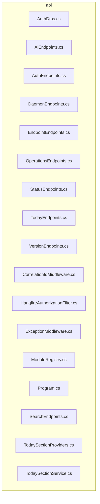

# Layer: api

节点总数（本层）: 17

```mermaid
flowchart TB
  subgraph layer_api [api]
    n1["AuthDtos.cs"]
    n2["AiEndpoints.cs"]
    n3["AuthEndpoints.cs"]
    n4["DaemonEndpoints.cs"]
    n5["EndpointEndpoints.cs"]
    n6["OperationsEndpoints.cs"]
    n7["StatusEndpoints.cs"]
    n8["TodayEndpoints.cs"]
    n9["VersionEndpoints.cs"]
    n10["CorrelationIdMiddleware.cs"]
    n11["HangfireAuthorizationFilter.cs"]
    n12["ExceptionMiddleware.cs"]
    n13["ModuleRegistry.cs"]
    n14["Program.cs"]
    n15["SearchEndpoints.cs"]
    n16["TodaySectionProviders.cs"]
    n17["TodaySectionService.cs"]
  end
```

全量连接见 [交互图](../interactive/index.html)（按 layer 过滤 $layer）。
