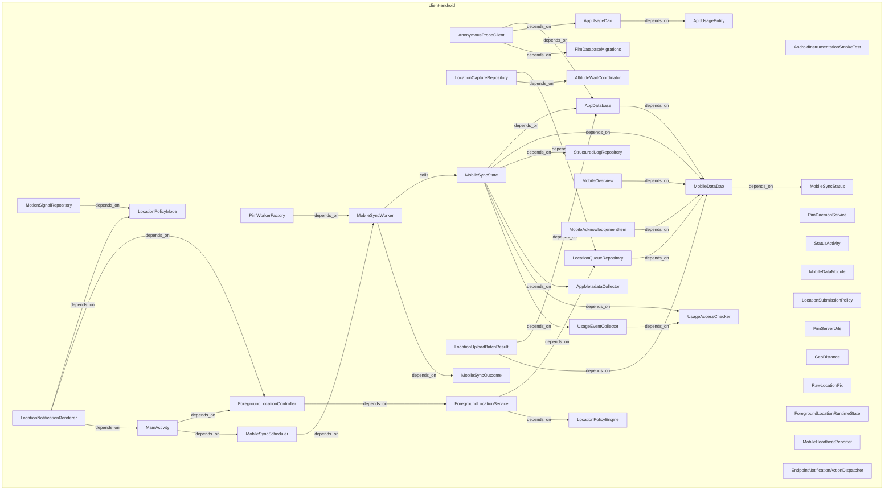

# Layer: client-android

节点总数（本层）: 89（图中展示前 40 个）

```mermaid
flowchart TB
  subgraph layer_client-android [client-android]
    n1["AndroidInstrumentationSmokeTest"]
    n2["PimDaemonService"]
    n3["StatusActivity"]
    n4["AppDatabase"]
    n5["AppUsageDao"]
    n6["AppUsageEntity"]
    n7["MobileDataDao"]
    n8["MobileDataModule"]
    n9["MobileSyncStatus"]
    n10["PimDatabaseMigrations"]
    n11["AnonymousProbeClient"]
    n12["PimWorkerFactory"]
    n13["LocationCaptureRepository"]
    n14["LocationQueueRepository"]
    n15["LocationSubmissionPolicy"]
    n16["MotionSignalRepository"]
    n17["PimServerUrls"]
    n18["GeoDistance"]
    n19["LocationPolicyEngine"]
    n20["LocationPolicyMode"]
    n21["AltitudeWaitCoordinator"]
    n22["RawLocationFix"]
    n23["ForegroundLocationController"]
    n24["ForegroundLocationRuntimeState"]
    n25["ForegroundLocationService"]
    n26["MainActivity"]
    n27["StructuredLogRepository"]
    n28["MobileOverview"]
    n29["LocationUploadBatchResult"]
    n30["MobileAcknowledgementItem"]
    n31["MobileHeartbeatReporter"]
    n32["MobileSyncState"]
    n33["MobileSyncOutcome"]
    n34["MobileSyncScheduler"]
    n35["MobileSyncWorker"]
    n36["AppMetadataCollector"]
    n37["UsageAccessChecker"]
    n38["UsageEventCollector"]
    n39["EndpointNotificationActionDispatcher"]
    n40["LocationNotificationRenderer"]
  end
  n4 -->|depends_on| n7
  n5 -->|depends_on| n6
  n7 -->|depends_on| n9
  n11 -->|depends_on| n4
  n11 -->|depends_on| n5
  n11 -->|depends_on| n10
  n12 -->|depends_on| n35
  n13 -->|depends_on| n14
  n13 -->|depends_on| n21
  n14 -->|depends_on| n7
  n16 -->|depends_on| n20
  n23 -->|depends_on| n25
  n25 -->|depends_on| n14
  n25 -->|depends_on| n19
  n26 -->|depends_on| n23
  n26 -->|depends_on| n34
  n28 -->|depends_on| n7
  n29 -->|depends_on| n4
  n29 -->|depends_on| n7
  n30 -->|depends_on| n7
  n32 -->|depends_on| n4
  n32 -->|depends_on| n7
  n32 -->|depends_on| n27
  n32 -->|depends_on| n36
  n32 -->|depends_on| n37
  n32 -->|depends_on| n38
  n34 -->|depends_on| n35
  n35 -->|calls| n32
  n35 -->|depends_on| n33
  n38 -->|depends_on| n37
  n40 -->|depends_on| n20
  n40 -->|depends_on| n23
  n40 -->|depends_on| n26
```

全量连接见 [交互图](../interactive/index.html)（按 layer 过滤 $layer）。
