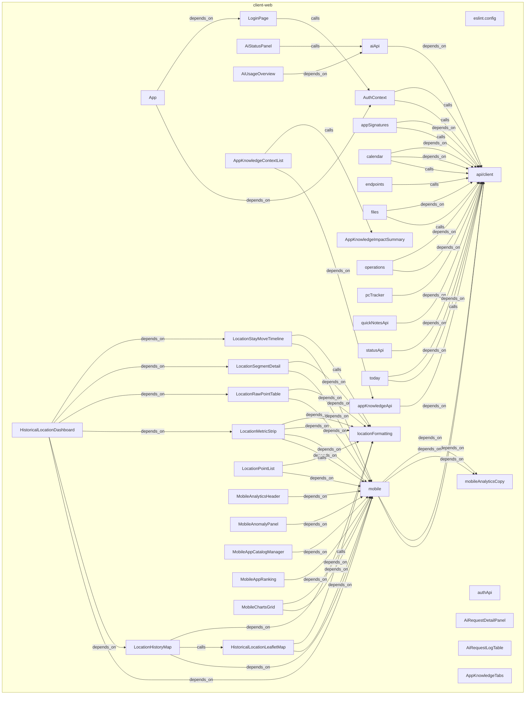

# Layer: client-web

节点总数（本层）: 143（图中展示前 40 个）

```mermaid
flowchart TB
  subgraph layer_client-web [client-web]
    n1["eslint.config"]
    n2["aiApi"]
    n3["appKnowledgeApi"]
    n4["appSignatures"]
    n5["calendar"]
    n6["api/client"]
    n7["endpoints"]
    n8["files"]
    n9["mobile"]
    n10["operations"]
    n11["pcTracker"]
    n12["quickNotesApi"]
    n13["statusApi"]
    n14["today"]
    n15["App"]
    n16["authApi"]
    n17["AuthContext"]
    n18["LoginPage"]
    n19["AiRequestDetailPanel"]
    n20["AiRequestLogTable"]
    n21["AiStatusPanel"]
    n22["AiUsageOverview"]
    n23["AppKnowledgeContextList"]
    n24["AppKnowledgeImpactSummary"]
    n25["AppKnowledgeTabs"]
    n26["HistoricalLocationDashboard"]
    n27["HistoricalLocationLeafletMap"]
    n28["locationFormatting"]
    n29["LocationHistoryMap"]
    n30["LocationMetricStrip"]
    n31["LocationPointList"]
    n32["LocationRawPointTable"]
    n33["LocationSegmentDetail"]
    n34["LocationStayMoveTimeline"]
    n35["mobileAnalyticsCopy"]
    n36["MobileAnalyticsHeader"]
    n37["MobileAnomalyPanel"]
    n38["MobileAppCatalogManager"]
    n39["MobileAppRanking"]
    n40["MobileChartsGrid"]
  end
  n2 -->|depends_on| n6
  n3 -->|depends_on| n6
  n4 -->|calls| n6
  n4 -->|depends_on| n6
  n5 -->|calls| n6
  n5 -->|depends_on| n6
  n5 -->|depends_on| n6
  n7 -->|calls| n6
  n8 -->|calls| n6
  n8 -->|depends_on| n6
  n9 -->|depends_on| n6
  n9 -->|depends_on| n6
  n9 -->|depends_on| n35
  n9 -->|depends_on| n35
  n10 -->|depends_on| n6
  n10 -->|depends_on| n6
  n11 -->|depends_on| n6
  n12 -->|depends_on| n6
  n13 -->|depends_on| n6
  n14 -->|calls| n6
  n14 -->|depends_on| n6
  n15 -->|depends_on| n17
  n15 -->|depends_on| n18
  n17 -->|calls| n6
  n17 -->|calls| n6
  n18 -->|calls| n17
  n21 -->|calls| n2
  n22 -->|depends_on| n2
  n23 -->|depends_on| n3
  n23 -->|calls| n24
  n26 -->|depends_on| n9
  n26 -->|depends_on| n29
  n26 -->|depends_on| n30
  n26 -->|depends_on| n32
  n26 -->|depends_on| n33
  n26 -->|depends_on| n34
  n27 -->|depends_on| n9
  n27 -->|calls| n28
  n29 -->|depends_on| n9
  n29 -->|calls| n27
  n29 -->|depends_on| n28
  n30 -->|depends_on| n9
  n30 -->|depends_on| n9
  n30 -->|depends_on| n28
  n30 -->|depends_on| n28
  n31 -->|depends_on| n9
  n31 -->|calls| n28
  n32 -->|depends_on| n9
  n32 -->|depends_on| n28
  n33 -->|depends_on| n9
  n33 -->|depends_on| n28
  n34 -->|depends_on| n9
  n34 -->|calls| n28
  n36 -->|depends_on| n9
  n37 -->|depends_on| n9
  n38 -->|depends_on| n9
  n39 -->|depends_on| n9
  n40 -->|depends_on| n9
  n40 -->|depends_on| n9
```

全量连接见 [交互图](../interactive/index.html)（按 layer 过滤 $layer）。
