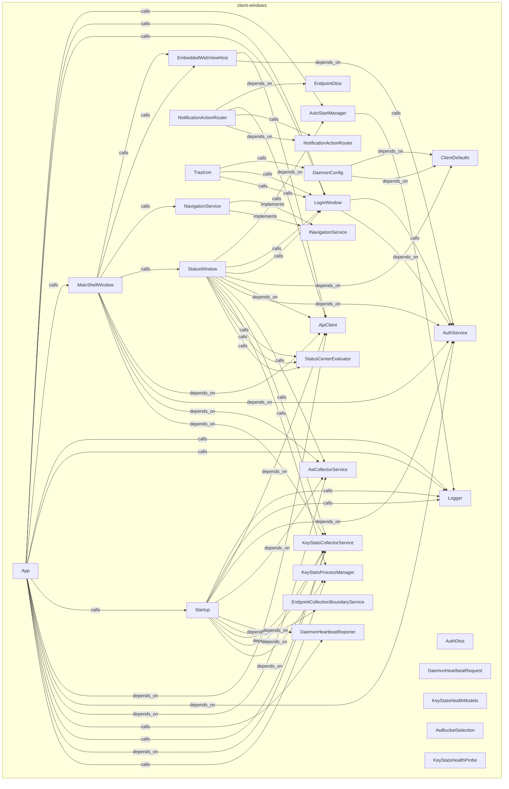

# Layer: client-windows

节点总数（本层）: 29

```mermaid
flowchart TB
  subgraph layer_client-windows [client-windows]
    n1["App"]
    n2["AutoStartManager"]
    n3["DaemonConfig"]
    n4["EmbeddedWebViewHost"]
    n5["LoginWindow"]
    n6["MainShellWindow"]
    n7["NotificationActionRouter"]
    n8["INavigationService"]
    n9["Logger"]
    n10["NavigationService"]
    n11["Startup"]
    n12["StatusWindow"]
    n13["TrayIcon"]
    n14["ClientDefaults"]
    n15["AuthDtos"]
    n16["DaemonHeartbeatRequest"]
    n17["EndpointDtos"]
    n18["KeyStatsHealthModels"]
    n19["ApiClient"]
    n20["AuthService"]
    n21["AwBucketSelection"]
    n22["AwCollectorService"]
    n23["DaemonHeartbeatReporter"]
    n24["EndpointCollectionBoundaryService"]
    n25["KeyStatsCollectorService"]
    n26["KeyStatsHealthProbe"]
    n27["KeyStatsProcessManager"]
    n28["NotificationActionRouter"]
    n29["StatusCenterEvaluator"]
  end
  n1 -->|calls| n2
  n1 -->|calls| n5
  n1 -->|calls| n5
  n1 -->|calls| n6
  n1 -->|calls| n9
  n1 -->|calls| n9
  n1 -->|calls| n11
  n1 -->|depends_on| n19
  n1 -->|depends_on| n20
  n1 -->|depends_on| n22
  n1 -->|calls| n23
  n1 -->|calls| n25
  n1 -->|depends_on| n25
  n1 -->|calls| n27
  n2 -->|calls| n9
  n3 -->|depends_on| n14
  n3 -->|depends_on| n14
  n4 -->|depends_on| n19
  n4 -->|depends_on| n20
  n5 -->|calls| n20
  n5 -->|depends_on| n20
  n6 -->|calls| n4
  n6 -->|calls| n4
  n6 -->|calls| n10
  n6 -->|calls| n12
  n6 -->|depends_on| n19
  n6 -->|depends_on| n20
  n6 -->|depends_on| n22
  n6 -->|depends_on| n25
  n7 -->|depends_on| n17
  n7 -->|calls| n19
  n7 -->|calls| n28
  n7 -->|depends_on| n28
  n10 -->|implements| n8
  n10 -->|implements| n8
  n11 -->|calls| n9
  n11 -->|calls| n9
  n11 -->|depends_on| n19
  n11 -->|depends_on| n20
  n11 -->|depends_on| n22
  n11 -->|depends_on| n23
  n11 -->|depends_on| n24
  n11 -->|depends_on| n25
  n11 -->|depends_on| n25
  n11 -->|depends_on| n27
  n12 -->|calls| n2
  n12 -->|calls| n5
  n12 -->|calls| n5
  n12 -->|depends_on| n14
  n12 -->|depends_on| n19
  n12 -->|depends_on| n20
  n12 -->|calls| n22
  n12 -->|calls| n25
  n12 -->|calls| n27
  n12 -->|calls| n29
  n12 -->|calls| n29
  n12 -->|calls| n29
  n13 -->|calls| n3
  n13 -->|calls| n5
  n13 -->|calls| n5
```

全量连接见 [交互图](../interactive/index.html)（按 layer 过滤 $layer）。
