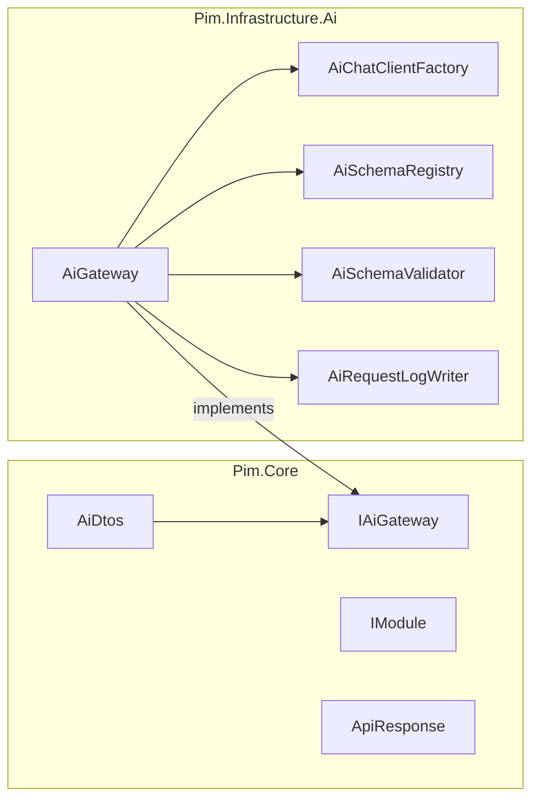

# Layer: core + infrastructure (wave 001 partial)

```mermaid
flowchart LR
  subgraph core [Pim.Core]
    AiDtos[AiDtos]
    IAiGateway[IAiGateway]
    IModule[IModule]
    ApiResponse[ApiResponse]
  end
  subgraph infra [Pim.Infrastructure.Ai]
    AiGateway[AiGateway]
    Factory[AiChatClientFactory]
    SchemaReg[AiSchemaRegistry]
    Validator[AiSchemaValidator]
    LogWriter[AiRequestLogWriter]
  end
  AiGateway -->|implements| IAiGateway
  AiGateway --> Factory
  AiGateway --> SchemaReg
  AiGateway --> Validator
  AiGateway --> LogWriter
  AiDtos --> IAiGateway
```
