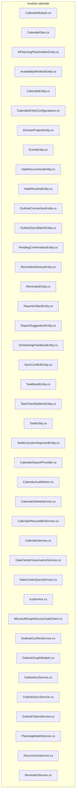

# Layer: module.calendar

节点总数（本层）: 44（图中展示前 40 个）

```mermaid
flowchart TB
  subgraph layer_module_calendar [module.calendar]
    n1["CalendarModule.cs"]
    n2["CalendarDtos.cs"]
    n3["AiPlanningPlaceholderEntity.cs"]
    n4["AvailabilityWindowEntity.cs"]
    n5["CalendarEntity.cs"]
    n6["CalendarEntityConfigurations.cs"]
    n7["DomainProjectEntity.cs"]
    n8["EventEntity.cs"]
    n9["HabitOccurrenceEntity.cs"]
    n10["HabitRoutineEntity.cs"]
    n11["OutlookConnectionEntity.cs"]
    n12["OutlookSyncBatchEntity.cs"]
    n13["PendingConfirmationEntity.cs"]
    n14["ReminderDeliveryEntity.cs"]
    n15["ReminderEntity.cs"]
    n16["ReportArtifactEntity.cs"]
    n17["ReportSuggestionEntity.cs"]
    n18["SchedulingFeedbackEntity.cs"]
    n19["SyncConflictEntity.cs"]
    n20["TaskBookEntity.cs"]
    n21["TaskChecklistItemEntity.cs"]
    n22["TaskEntity.cs"]
    n23["TaskExecutionSegmentEntity.cs"]
    n24["CalendarSearchProvider.cs"]
    n25["CalendarAuditWriter.cs"]
    n26["CalendarDeleteService.cs"]
    n27["CalendarRecycleBinService.cs"]
    n28["CalendarService.cs"]
    n29["DataCenterGovernanceService.cs"]
    n30["DataCenterQueryService.cs"]
    n31["IcsService.cs"]
    n32["MicrosoftGraphDeviceCodeClient.cs"]
    n33["OutlookConflictService.cs"]
    n34["OutlookGraphModels.cs"]
    n35["OutlookIcsService.cs"]
    n36["OutlookSyncService.cs"]
    n37["OutlookTokenService.cs"]
    n38["PlanningModelService.cs"]
    n39["RecurrenceService.cs"]
    n40["ReminderService.cs"]
  end
```

全量连接见 [交互图](../interactive/index.html)（按 layer 过滤 $layer）。
