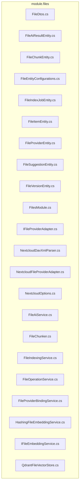

# Layer: module.files

节点总数（本层）: 22

```mermaid
flowchart TB
  subgraph layer_module_files [module.files]
    n1["FileDtos.cs"]
    n2["FileAiResultEntity.cs"]
    n3["FileChunkEntity.cs"]
    n4["FileEntityConfigurations.cs"]
    n5["FileIndexJobEntity.cs"]
    n6["FileItemEntity.cs"]
    n7["FileProviderEntity.cs"]
    n8["FileSuggestionEntity.cs"]
    n9["FileVersionEntity.cs"]
    n10["FilesModule.cs"]
    n11["IFileProviderAdapter.cs"]
    n12["NextcloudDavXmlParser.cs"]
    n13["NextcloudFileProviderAdapter.cs"]
    n14["NextcloudOptions.cs"]
    n15["FileAiService.cs"]
    n16["FileChunker.cs"]
    n17["FileIndexingService.cs"]
    n18["FileOperationService.cs"]
    n19["FileProviderBindingService.cs"]
    n20["HashingFileEmbeddingService.cs"]
    n21["IFileEmbeddingService.cs"]
    n22["QdrantFileVectorStore.cs"]
  end
```

全量连接见 [交互图](../interactive/index.html)（按 layer 过滤 $layer）。
