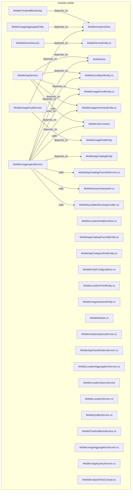

# Layer: module.mobile

节点总数（本层）: 35

```mermaid
flowchart TB
  subgraph layer_module_mobile [module.mobile]
    n1["MobileAnalyticsDtos"]
    n2["MobileDtos"]
    n3["MobileLocationAnalyticsDtos.cs"]
    n4["MobileAppCatalogEntity"]
    n5["MobileAppCatalogOverrideEntity.cs"]
    n6["MobileAppCategoryRuleEntity.cs"]
    n7["MobileDeviceEntity.cs"]
    n8["MobileEntityConfigurations.cs"]
    n9["MobileLocationPointEntity.cs"]
    n10["MobileSyncBatchEntity.cs"]
    n11["MobileTimelineBlockEntity"]
    n12["MobileUsageAggregateEntity"]
    n13["MobileUsageEventEntity.cs"]
    n14["MobileUsageGoalEntity"]
    n15["MobileUsageSessionEntity.cs"]
    n16["MobileUsageSummaryEntity.cs"]
    n17["MobileModule.cs"]
    n18["MobileAnalyticsQueryService.cs"]
    n19["MobileAppCatalogOverrideService.cs"]
    n20["MobileAppClassificationService.cs"]
    n21["MobileDeviceService"]
    n22["MobileGapService"]
    n23["MobileLocationAggregationService.cs"]
    n24["MobileLocationQueryService"]
    n25["MobileLocationService.cs"]
    n26["MobileQualityService.cs"]
    n27["MobileSessionInterpreter.cs"]
    n28["MobileSyncBatchEnvelopeCodec.cs"]
    n29["MobileTimelineBlockService.cs"]
    n30["MobileUsageAggregationService.cs"]
    n31["MobileUsageGoalService"]
    n32["MobileUsageIngestService"]
    n33["MobileUsageQueryService.cs"]
    n34["MobileUserContext"]
    n35["MobileEndpointTestCompat.cs"]
  end
  n11 -->|depends_on| n1
  n12 -->|depends_on| n1
  n21 -->|depends_on| n7
  n22 -->|depends_on| n2
  n22 -->|depends_on| n10
  n22 -->|depends_on| n13
  n22 -->|depends_on| n16
  n22 -->|calls| n34
  n31 -->|depends_on| n1
  n31 -->|depends_on| n14
  n32 -->|depends_on| n2
  n32 -->|depends_on| n4
  n32 -->|depends_on| n10
  n32 -->|depends_on| n13
  n32 -->|depends_on| n16
  n32 -->|calls| n19
  n32 -->|calls| n27
  n32 -->|calls| n28
  n32 -->|calls| n34
```

全量连接见 [交互图](../interactive/index.html)（按 layer 过滤 $layer）。
