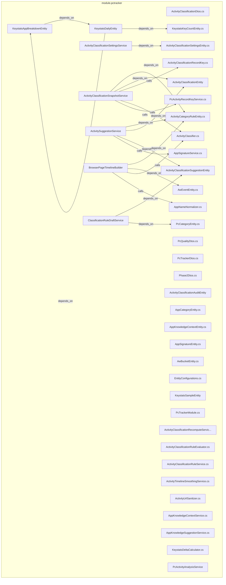

# Layer: module.pctracker

节点总数（本层）: 45（图中展示前 40 个）

```mermaid
flowchart TB
  subgraph layer_module_pctracker [module.pctracker]
    n1["ActivityClassificationDtos.cs"]
    n2["PcQualityDtos.cs"]
    n3["PcTrackerDtos.cs"]
    n4["Phase2Dtos.cs"]
    n5["ActivityCategoryRuleEntity.cs"]
    n6["ActivityClassificationAuditEntity"]
    n7["ActivityClassificationEntity"]
    n8["ActivityClassificationSettingsEntity.cs"]
    n9["ActivityClassificationSuggestionEntity"]
    n10["AppCategoryEntity.cs"]
    n11["AppKnowledgeContextEntity.cs"]
    n12["AppSignatureEntity.cs"]
    n13["AwBucketEntity.cs"]
    n14["AwEventEntity.cs"]
    n15["EntityConfigurations.cs"]
    n16["KeystatsAppBreakdownEntity"]
    n17["KeystatsDailyEntity"]
    n18["KeystatsKeyCountEntity.cs"]
    n19["KeystatsSampleEntity"]
    n20["PcCategoryEntity.cs"]
    n21["PcTrackerModule.cs"]
    n22["ActivityClassificationRecomputeServic..."]
    n23["ActivityClassificationRecordKey.cs"]
    n24["ActivityClassificationRuleEvaluator.cs"]
    n25["ActivityClassificationRuleService.cs"]
    n26["ActivityClassificationSettingsService"]
    n27["ActivityClassificationSnapshotService"]
    n28["ActivityClassifier.cs"]
    n29["ActivitySuggestionService"]
    n30["ActivityTimelineSmoothingService.cs"]
    n31["ActivityUrlSanitizer.cs"]
    n32["AppKnowledgeContextService.cs"]
    n33["AppKnowledgeSuggestionService.cs"]
    n34["AppNameNormalizer.cs"]
    n35["AppSignatureService.cs"]
    n36["BrowserPageTimelineBuilder"]
    n37["ClassificationRuleDraftService"]
    n38["KeystatsDeltaCalculator.cs"]
    n39["PcActivityAnalysisService"]
    n40["PcActivityRecordKeyService.cs"]
  end
  n16 -->|depends_on| n17
  n17 -->|depends_on| n16
  n17 -->|depends_on| n18
  n26 -->|depends_on| n8
  n27 -->|depends_on| n5
  n27 -->|depends_on| n7
  n27 -->|calls| n23
  n27 -->|calls| n28
  n27 -->|calls| n40
  n29 -->|depends_on| n5
  n29 -->|depends_on| n7
  n29 -->|depends_on| n9
  n29 -->|calls| n35
  n36 -->|depends_on| n5
  n36 -->|depends_on| n14
  n36 -->|calls| n28
  n36 -->|calls| n34
  n37 -->|depends_on| n9
  n37 -->|depends_on| n20
```

全量连接见 [交互图](../interactive/index.html)（按 layer 过滤 $layer）。
