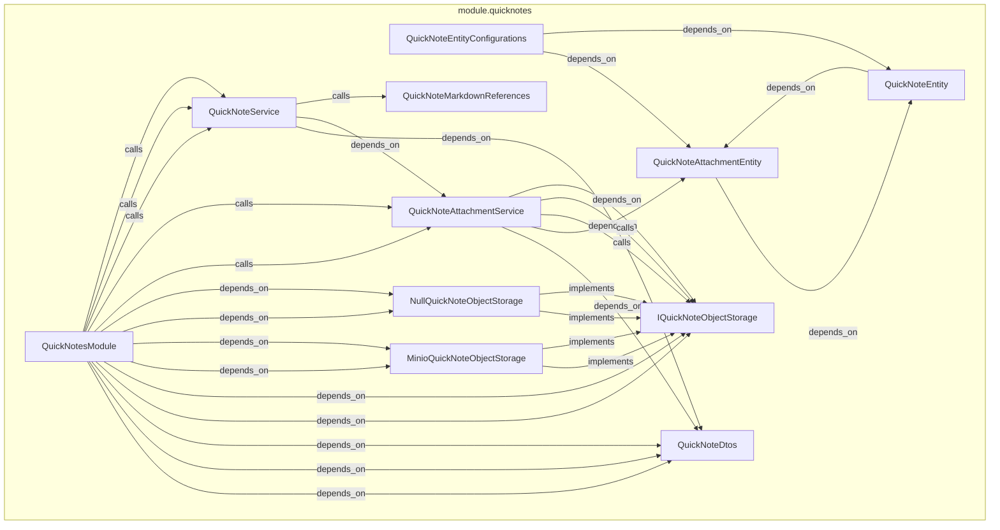

# Layer: module.quicknotes

节点总数（本层）: 11

```mermaid
flowchart TB
  subgraph layer_module_quicknotes [module.quicknotes]
    n1["QuickNoteDtos"]
    n2["QuickNoteAttachmentEntity"]
    n3["QuickNoteEntity"]
    n4["QuickNoteEntityConfigurations"]
    n5["QuickNotesModule"]
    n6["IQuickNoteObjectStorage"]
    n7["MinioQuickNoteObjectStorage"]
    n8["NullQuickNoteObjectStorage"]
    n9["QuickNoteAttachmentService"]
    n10["QuickNoteMarkdownReferences"]
    n11["QuickNoteService"]
  end
  n2 -->|depends_on| n3
  n3 -->|depends_on| n2
  n4 -->|depends_on| n2
  n4 -->|depends_on| n3
  n5 -->|depends_on| n1
  n5 -->|depends_on| n1
  n5 -->|depends_on| n1
  n5 -->|depends_on| n6
  n5 -->|depends_on| n6
  n5 -->|depends_on| n7
  n5 -->|depends_on| n7
  n5 -->|depends_on| n8
  n5 -->|depends_on| n8
  n5 -->|calls| n9
  n5 -->|calls| n9
  n5 -->|calls| n11
  n5 -->|calls| n11
  n5 -->|calls| n11
  n7 -->|implements| n6
  n7 -->|implements| n6
  n8 -->|implements| n6
  n8 -->|implements| n6
  n9 -->|depends_on| n1
  n9 -->|depends_on| n2
  n9 -->|calls| n6
  n9 -->|calls| n6
  n9 -->|depends_on| n6
  n11 -->|depends_on| n1
  n11 -->|depends_on| n9
  n11 -->|calls| n10
```

全量连接见 [交互图](../interactive/index.html)（按 layer 过滤 $layer）。
