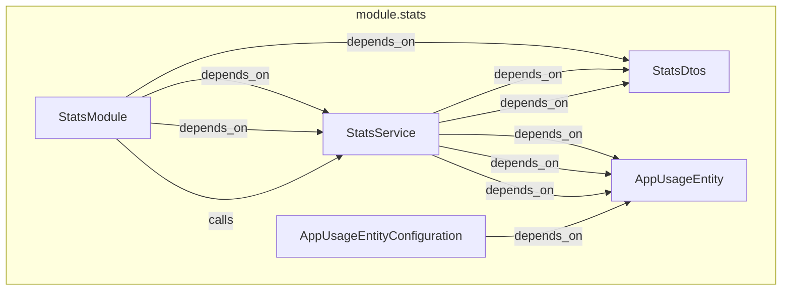

# Layer: module.stats

节点总数（本层）: 5

```mermaid
flowchart TB
  subgraph layer_module_stats [module.stats]
    n1["StatsDtos"]
    n2["AppUsageEntity"]
    n3["AppUsageEntityConfiguration"]
    n4["StatsService"]
    n5["StatsModule"]
  end
  n3 -->|depends_on| n2
  n4 -->|depends_on| n1
  n4 -->|depends_on| n1
  n4 -->|depends_on| n2
  n4 -->|depends_on| n2
  n4 -->|depends_on| n2
  n5 -->|depends_on| n1
  n5 -->|calls| n4
  n5 -->|depends_on| n4
  n5 -->|depends_on| n4
```

全量连接见 [交互图](../interactive/index.html)（按 layer 过滤 $layer）。
