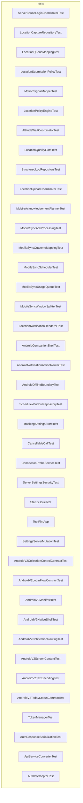

# Layer: tests

节点总数（本层）: 228（图中展示前 40 个）

```mermaid
flowchart TB
  subgraph layer_tests [tests]
    n1["ServerBoundLoginCoordinatorTest"]
    n2["LocationCaptureRepositoryTest"]
    n3["LocationQueueMappingTest"]
    n4["LocationSubmissionPolicyTest"]
    n5["MotionSignalMapperTest"]
    n6["LocationPolicyEngineTest"]
    n7["AltitudeWaitCoordinatorTest"]
    n8["LocationQualityGateTest"]
    n9["StructuredLogRepositoryTest"]
    n10["LocationUploadCoordinatorTest"]
    n11["MobileAcknowledgementPlannerTest"]
    n12["MobileSyncAckProcessingTest"]
    n13["MobileSyncOutcomeMappingTest"]
    n14["MobileSyncSchedulerTest"]
    n15["MobileSyncUsageQueueTest"]
    n16["MobileSyncWindowSplitterTest"]
    n17["LocationNotificationRendererTest"]
    n18["AndroidCompanionShellTest"]
    n19["AndroidNotificationActionRouterTest"]
    n20["AndroidOfflineBoundaryTest"]
    n21["ScheduleWindowRepositoryTest"]
    n22["TrackingSettingsStoreTest"]
    n23["CancellableCallTest"]
    n24["ConnectionProbeServiceTest"]
    n25["ServerSettingsSecurityTest"]
    n26["StatusIssueTest"]
    n27["TestPimApp"]
    n28["SettingsServerMutationTest"]
    n29["AndroidV2CollectionControlContractTest"]
    n30["AndroidV2LoginFlowContractTest"]
    n31["AndroidV2ManifestTest"]
    n32["AndroidV2NativeShellTest"]
    n33["AndroidV2NotificationRoutingTest"]
    n34["AndroidV2ScreenContentTest"]
    n35["AndroidV2TextEncodingTest"]
    n36["AndroidV2TodayStatusContractTest"]
    n37["TokenManagerTest"]
    n38["AuthResponseSerializationTest"]
    n39["ApiServiceConverterTest"]
    n40["AuthInterceptorTest"]
  end
```

全量连接见 [交互图](../interactive/index.html)（按 layer 过滤 $layer）。
