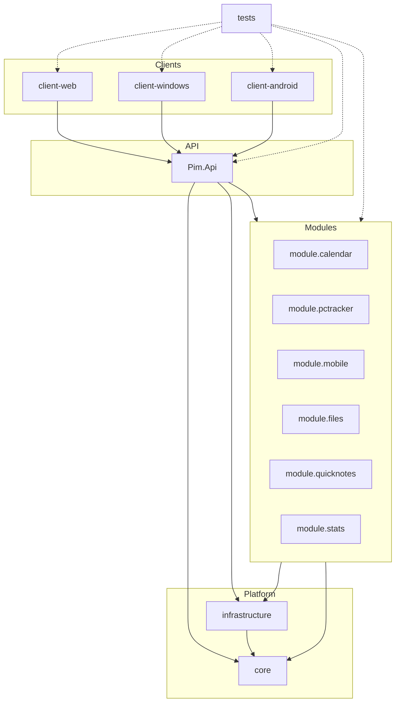

# System Overview

分层总览（节点为 layer，非全量文件）。全量关系见 [interactive/index.html](interactive/index.html)。

## Layer docs

- [core](layers/core.md)
- [infrastructure](layers/infrastructure.md)
- [api](layers/api.md)
- [module-stats](layers/module-stats.md)
- [module-quicknotes](layers/module-quicknotes.md)
- [module-files](layers/module-files.md)
- [module-mobile](layers/module-mobile.md)
- [module-pctracker](layers/module-pctracker.md)
- [module-calendar](layers/module-calendar.md)
- [client-web](layers/client-web.md)
- [client-windows](layers/client-windows.md)
- [client-android](layers/client-android.md)
- [tests](layers/tests.md)