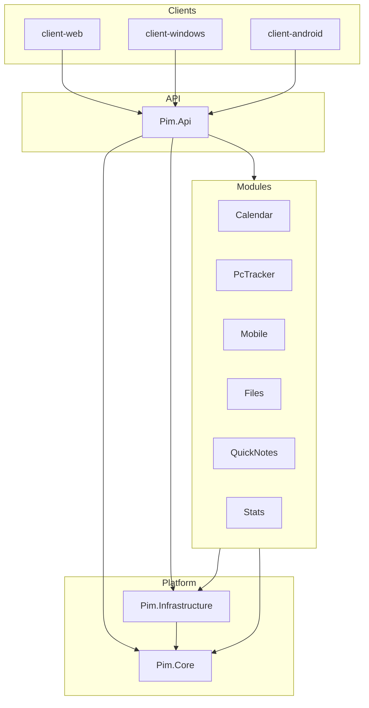

# System Overview

```mermaid
flowchart TB
  subgraph clients [Clients]
    WEB[client-web]
    WIN[client-windows]
    AND[client-android]
  end
  subgraph api_layer [API]
    API[Pim.Api]
  end
  subgraph modules [Modules]
    CAL[Calendar]
    PC[PcTracker]
    MOB[Mobile]
    FIL[Files]
    QN[QuickNotes]
    ST[Stats]
  end
  subgraph platform [Platform]
    CORE[Pim.Core]
    INFRA[Pim.Infrastructure]
  end
  WEB --> API
  WIN --> API
  AND --> API
  API --> modules
  API --> CORE
  API --> INFRA
  modules --> CORE
  modules --> INFRA
  INFRA --> CORE
```
