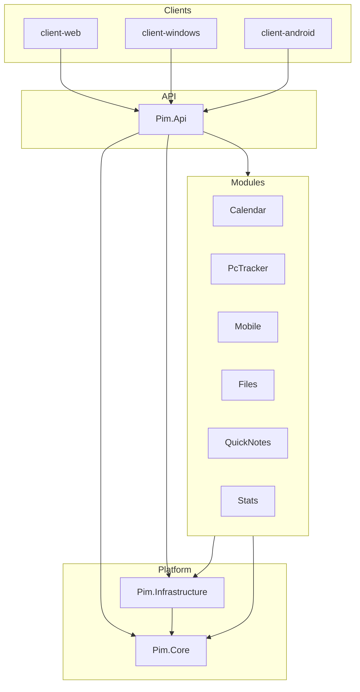

# Full Codebase Pseudocode Docs Implementation Plan

> **For agentic workers:** REQUIRED SUB-SKILL: Use superpowers:subagent-driven-development (recommended) or superpowers:executing-plans to implement this plan task-by-task. Steps use checkbox (`- [ ]`) syntax for tracking.  
> **HARD RULE:** Every documentation wave MUST launch **exactly 10 concurrent subagents** unless remaining incomplete files are fewer than 10. Orchestrator does not write bulk pseudocode.

**Goal:** 为 `src` + `tests` 全部手写源码生成 `docs/pseudocode/` 双粒度中文伪代码，并交付 Mermaid 分层图 + 可交互全量关系图。

**Architecture:** 方案 A——子代理逐文件通读源码后手写 Markdown；总控维护 manifest/coverage、互斥 10 槽分区、合并关系边到 `graph-data.json` 与 Mermaid。路径镜像：`src/X.cs` → `docs/pseudocode/files/src/X.cs.md`。

**Tech Stack:** Markdown, Mermaid, 静态 HTML + JSON 力导向图, PowerShell 清单脚本, GitHub PR（`codex/pseudocode-docs-*`）

**Spec:** `docs/superpowers/specs/2026-07-12-full-codebase-pseudocode-docs-design.md`

**规模基线（执行前以 manifest 锁定为准）：** 约 775 个候选文件（排除 `node_modules`/`bin`/`obj`/`dist`/`publish`/`build`/`.gradle`/`wwwroot`）。

---

## File Map

| 路径 | 职责 |
|------|------|
| `docs/pseudocode/README.md` | 入口、约定、图链接 |
| `docs/pseudocode/_index/file-manifest.md` | 全量源路径 ↔ 文档路径 ↔ 状态 |
| `docs/pseudocode/_index/coverage.md` | 进度、当前波次、下一批入口 |
| `docs/pseudocode/_index/wave-assignments.json` | 当前/最近一波 10 槽路径列表 |
| `docs/pseudocode/_templates/file-doc.md` | 单文件文档模板 |
| `docs/pseudocode/_templates/subagent-prompt.md` | 子代理提示词模板 |
| `docs/pseudocode/graphs/overview.mmd.md` | 系统 layer 总览 Mermaid |
| `docs/pseudocode/graphs/layers/*.md` | 分层/模块子图 |
| `docs/pseudocode/graphs/interactive/index.html` | 可交互关系图 |
| `docs/pseudocode/graphs/interactive/graph-data.json` | 全量 nodes/edges |
| `docs/pseudocode/files/**` | 镜像伪代码正文 |
| `scripts/pseudocode/New-FileManifest.ps1` | 生成/刷新 manifest 清单 |
| `scripts/pseudocode/Split-WaveAssignments.ps1` | 将 pending 均分为 10 槽 |
| `scripts/pseudocode/Merge-Coverage.ps1` | 根据已写 docs 勾选 coverage |
| `scripts/pseudocode/Merge-GraphData.ps1` | 合并 edges 片段进 graph-data.json |

---

## Single-File Doc Template (canonical)

每个源文件对应一份文档，必须含以下章节（标题一字不差）：

```markdown
# <source-relative-path>

## 元信息
- 语言：
- 程序集或包：
- 职责：
- 主要依赖：
- 被谁使用：

## 函数级结构化伪代码

### <TypeName>
#### <MethodSignature>
- 输入：
- 输出：
- 副作用：
- 步骤：
  1. ...
- 分支与异常：
- 调用：

## 近逐行中文伪代码

1. ...
2. ...

## 关系边
```json
{
  "nodes": [
    {
      "id": "<source-relative-path>",
      "label": "<TypeOrFileName>",
      "path": "<source-relative-path>",
      "doc": "docs/pseudocode/files/<source-relative-path>.md",
      "layer": "<layer>",
      "kind": "<kind>"
    }
  ],
  "edges": [
    { "from": "<path-or-type>", "to": "<path-or-type>", "type": "depends_on|calls|implements|extends|tests|http" }
  ]
}
```
```

`layer` 取值：`core` | `infrastructure` | `api` | `module.stats` | `module.quicknotes` | `module.files` | `module.mobile` | `module.pctracker` | `module.calendar` | `client-web` | `client-windows` | `client-android` | `tests`  
`kind` 取值：`entrypoint` | `endpoint` | `service` | `entity` | `dto` | `middleware` | `ui` | `test` | `other`

---

## Subagent Prompt Template (every wave)

总控对每个槽位 A1–A10 使用以下提示词（填入 `{{SLOT}}` 与路径列表）：

```markdown
你是伪代码文档子代理，槽位 {{SLOT}}。

## 强制规则
1. 只处理下列源文件，禁止读写列表外的 docs/pseudocode/files 路径。
2. 对每个文件：必须用 Read 工具完整打开通读后再写文档（方案 A）。禁止未读就写。
3. 文档路径：docs/pseudocode/files/<相对路径>.md（正斜杠）。
4. 必须同时写「函数级结构化伪代码」和「近逐行中文伪代码」，章节标题与仓库模板一致。
5. 正文简体中文；标识符/API/路径保留英文。
6. 不修改任何业务源码；只创建/更新 docs/pseudocode/files/** 下你的文件。
7. 每个文档底部「关系边」使用 JSON 代码块（nodes + edges）。

## 分配文件
{{FILE_LIST}}

## 完成标准
- 列表内每个文件都有对应 .md
- 双粒度齐全
- 返回严格 JSON（不要包在 markdown 外的闲聊）：

{
  "slot": "{{SLOT}}",
  "completed": ["..."],
  "docs_written": ["..."],
  "edges": [{"from":"...","to":"...","type":"calls"}],
  "blocked": [],
  "notes": ""
}
```

---

### Task 0: Branch Workspace

**Files:** none (git only)

- [ ] **Step 1: 从最新 master 开实现分支**

```powershell
git fetch origin master
git checkout master
git pull origin master
git checkout -b codex/pseudocode-docs-b0-scaffold
```

Expected: 干净分支基于最新 `origin/master`。

- [ ] **Step 2: 确认规格存在**

```powershell
Test-Path docs/superpowers/specs/2026-07-12-full-codebase-pseudocode-docs-design.md
Test-Path docs/superpowers/plans/2026-07-12-full-codebase-pseudocode-docs.md
```

Expected: 均为 `True`。

- [ ] **Step 3: 本任务不改源码**

---

### Task 1: Scaffold Scripts And Directory Tree

**Files:**
- Create: `scripts/pseudocode/New-FileManifest.ps1`
- Create: `scripts/pseudocode/Split-WaveAssignments.ps1`
- Create: `scripts/pseudocode/Merge-Coverage.ps1`
- Create: `scripts/pseudocode/Merge-GraphData.ps1`
- Create: `docs/pseudocode/README.md`
- Create: `docs/pseudocode/_templates/file-doc.md`
- Create: `docs/pseudocode/_templates/subagent-prompt.md`
- Create: `docs/pseudocode/_index/coverage.md`
- Create: `docs/pseudocode/graphs/overview.mmd.md`
- Create: `docs/pseudocode/graphs/layers/.gitkeep`
- Create: `docs/pseudocode/graphs/interactive/index.html`
- Create: `docs/pseudocode/graphs/interactive/graph-data.json`

- [ ] **Step 1: 创建 `New-FileManifest.ps1`**

```powershell
# scripts/pseudocode/New-FileManifest.ps1
param(
  [string]$RepoRoot = (Resolve-Path (Join-Path $PSScriptRoot '..\..')).Path,
  [string]$OutFile = (Join-Path $RepoRoot 'docs\pseudocode\_index\file-manifest.md')
)

$ErrorActionPreference = 'Stop'
$exts = @('*.cs','*.ts','*.tsx','*.kt','*.js')
$exclude = '\\(node_modules|bin|obj|dist|publish|\.gradle|build)\\|\\wwwroot\\'
$files = @()
foreach ($r in @('src','tests')) {
  $path = Join-Path $RepoRoot $r
  if (Test-Path $path) {
    $files += Get-ChildItem -Path $path -Recurse -File -Include $exts |
      Where-Object { $_.FullName -notmatch $exclude }
  }
}
$rels = $files |
  ForEach-Object { ($_.FullName.Substring($RepoRoot.Length + 1) -replace '\\','/') } |
  Sort-Object -Unique

$sb = New-Object System.Text.StringBuilder
[void]$sb.AppendLine('# File Manifest')
[void]$sb.AppendLine('')
[void]$sb.AppendLine("Generated: $(Get-Date -Format 'yyyy-MM-dd HH:mm:ss')")
[void]$sb.AppendLine("Total: $($rels.Count)")
[void]$sb.AppendLine('')
[void]$sb.AppendLine('| Status | Source | Doc |')
[void]$sb.AppendLine('| --- | --- | --- |')
foreach ($rel in $rels) {
  $doc = "docs/pseudocode/files/$rel.md"
  $done = Test-Path (Join-Path $RepoRoot ($doc -replace '/','\'))
  $status = if ($done) { 'x' } else { ' ' }
  [void]$sb.AppendLine("| [$status] | `$rel` | `$doc` |".Replace('$rel', $rel).Replace('$doc', $doc))
}

$dir = Split-Path $OutFile -Parent
if (-not (Test-Path $dir)) { New-Item -ItemType Directory -Path $dir -Force | Out-Null }
Set-Content -Path $OutFile -Value $sb.ToString() -Encoding UTF8
Write-Host "Wrote $($rels.Count) entries -> $OutFile"
```

- [ ] **Step 2: 创建 `Split-WaveAssignments.ps1`**

```powershell
# scripts/pseudocode/Split-WaveAssignments.ps1
param(
  [string]$RepoRoot = (Resolve-Path (Join-Path $PSScriptRoot '..\..')).Path,
  [int]$WaveSizePerSlot = 8,
  [string]$OutFile = (Join-Path $RepoRoot 'docs\pseudocode\_index\wave-assignments.json')
)

$ErrorActionPreference = 'Stop'
$manifest = Join-Path $RepoRoot 'docs\pseudocode\_index\file-manifest.md'
if (-not (Test-Path $manifest)) { throw "manifest missing: $manifest" }

$pending = @()
Get-Content $manifest | ForEach-Object {
  if ($_ -match '^\| \[ \] \| `([^`]+)` \|') { $pending += $Matches[1] }
}

$take = [Math]::Min($pending.Count, 10 * $WaveSizePerSlot)
$slice = $pending | Select-Object -First $take
$slots = @{}
for ($i = 0; $i -lt 10; $i++) { $slots["A$($i+1)"] = @() }
for ($i = 0; $i -lt $slice.Count; $i++) {
  $slot = "A$(($i % 10) + 1)"
  $slots[$slot] += $slice[$i]
}

$payload = [ordered]@{
  generated = (Get-Date -Format 'o')
  pendingTotal = $pending.Count
  assignedTotal = $slice.Count
  slots = $slots
}
$json = $payload | ConvertTo-Json -Depth 6
Set-Content -Path $OutFile -Value $json -Encoding UTF8
Write-Host "Assigned $($slice.Count) / pending $($pending.Count) -> $OutFile"
if ($pending.Count -gt 0 -and $slice.Count -lt 10 -and $pending.Count -ge 10) {
  throw 'Invariant broken: had >=10 pending but assigned <10 files total'
}
```

- [ ] **Step 3: 创建 `Merge-Coverage.ps1`**

```powershell
# scripts/pseudocode/Merge-Coverage.ps1
param(
  [string]$RepoRoot = (Resolve-Path (Join-Path $PSScriptRoot '..\..')).Path
)

$ErrorActionPreference = 'Stop'
& (Join-Path $PSScriptRoot 'New-FileManifest.ps1') -RepoRoot $RepoRoot

$manifest = Join-Path $RepoRoot 'docs\pseudocode\_index\file-manifest.md'
$lines = Get-Content $manifest
$total = 0; $done = 0
foreach ($line in $lines) {
  if ($line -match '^\| \[([ x])\] \|') {
    $total++
    if ($Matches[1] -eq 'x') { $done++ }
  }
}
$pct = if ($total -eq 0) { 0 } else { [math]::Round(100.0 * $done / $total, 2) }
$coverage = @"
# Coverage

- Updated: $(Get-Date -Format 'yyyy-MM-dd HH:mm:ss')
- Done: $done / $total ($pct%)
- Next: run ``scripts/pseudocode/Split-WaveAssignments.ps1`` then launch 10 subagents

## Rules
- Only mark done when dual-granularity doc exists for the source file.
- Orchestrator merges after each 10-agent wave.
"@
Set-Content -Path (Join-Path $RepoRoot 'docs\pseudocode\_index\coverage.md') -Value $coverage -Encoding UTF8
Write-Host "Coverage $done/$total ($pct%)"
```

- [ ] **Step 4: 创建 `Merge-GraphData.ps1`**

```powershell
# scripts/pseudocode/Merge-GraphData.ps1
param(
  [string]$RepoRoot = (Resolve-Path (Join-Path $PSScriptRoot '..\..')).Path,
  [string]$EdgesDir = (Join-Path $RepoRoot 'docs\pseudocode\_index\edge-fragments')
)

$ErrorActionPreference = 'Stop'
$out = Join-Path $RepoRoot 'docs\pseudocode\graphs\interactive\graph-data.json'
$nodes = @{}
$edges = New-Object System.Collections.Generic.List[object]

function Import-Fragment($path) {
  $raw = Get-Content $path -Raw | ConvertFrom-Json
  foreach ($n in @($raw.nodes)) {
    if ($null -ne $n -and $n.id) { $nodes[$n.id] = $n }
  }
  foreach ($e in @($raw.edges)) {
    if ($null -ne $e -and $e.from -and $e.to) { $edges.Add($e) }
  }
}

# Prefer explicit fragments; also scan written docs for ```json relation blocks is out of scope for script v1
if (Test-Path $EdgesDir) {
  Get-ChildItem $EdgesDir -Filter *.json | ForEach-Object { Import-Fragment $_.FullName }
}

# Ensure every completed doc path has at least a node
$filesRoot = Join-Path $RepoRoot 'docs\pseudocode\files'
if (Test-Path $filesRoot) {
  Get-ChildItem $filesRoot -Recurse -Filter *.md | ForEach-Object {
    $relDoc = $_.FullName.Substring($RepoRoot.Length + 1) -replace '\\','/'
    $src = $relDoc -replace '^docs/pseudocode/files/','' -replace '\.md$',''
    if (-not $nodes.ContainsKey($src)) {
      $layer = 'other'
      if ($src -like 'src/Pim.Core/*') { $layer = 'core' }
      elseif ($src -like 'src/Pim.Infrastructure/*') { $layer = 'infrastructure' }
      elseif ($src -like 'src/Pim.Api/*') { $layer = 'api' }
      elseif ($src -like 'src/modules/Pim.Module.Stats/*') { $layer = 'module.stats' }
      elseif ($src -like 'src/modules/Pim.Module.QuickNotes/*') { $layer = 'module.quicknotes' }
      elseif ($src -like 'src/modules/Pim.Module.Files/*') { $layer = 'module.files' }
      elseif ($src -like 'src/modules/Pim.Module.Mobile/*') { $layer = 'module.mobile' }
      elseif ($src -like 'src/modules/Pim.Module.PcTracker/*') { $layer = 'module.pctracker' }
      elseif ($src -like 'src/modules/Pim.Module.Calendar/*') { $layer = 'module.calendar' }
      elseif ($src -like 'src/client-web/*') { $layer = 'client-web' }
      elseif ($src -like 'src/client-windows/*') { $layer = 'client-windows' }
      elseif ($src -like 'src/client-android/*') { $layer = 'client-android' }
      elseif ($src -like 'tests/*') { $layer = 'tests' }
      $nodes[$src] = [pscustomobject]@{
        id = $src
        label = Split-Path $src -Leaf
        path = $src
        doc = $relDoc
        layer = $layer
        kind = $(if ($layer -eq 'tests') { 'test' } else { 'other' })
      }
    }
  }
}

$result = [ordered]@{
  nodes = @($nodes.Values | Sort-Object id)
  edges = @($edges | Sort-Object from, to, type)
}
$dir = Split-Path $out -Parent
if (-not (Test-Path $dir)) { New-Item -ItemType Directory -Path $dir -Force | Out-Null }
($result | ConvertTo-Json -Depth 8) | Set-Content -Path $out -Encoding UTF8
Write-Host "graph-data nodes=$($result.nodes.Count) edges=$($result.edges.Count)"
```

- [ ] **Step 5: 写 README、模板、空图壳**

`docs/pseudocode/README.md`:

```markdown
# PIM 全库伪代码文档

- 规格：`docs/superpowers/specs/2026-07-12-full-codebase-pseudocode-docs-design.md`
- 计划：`docs/superpowers/plans/2026-07-12-full-codebase-pseudocode-docs.md`
- 清单：`_index/file-manifest.md`
- 进度：`_index/coverage.md`
- 总览图：`graphs/overview.mmd.md`
- 交互图：`graphs/interactive/index.html`

## 约定
- 方案 A：逐文件通读后手写
- 双粒度：函数级 + 近逐行
- 每波 10 子代理并行
```

`docs/pseudocode/graphs/interactive/graph-data.json` 初始：

```json
{
  "nodes": [],
  "edges": []
}
```

`docs/pseudocode/graphs/interactive/index.html` 最小可用壳：

```html
<!doctype html>
<html lang="zh-CN">
<head>
  <meta charset="utf-8" />
  <title>PIM Pseudocode Graph</title>
  <style>
    body { margin: 0; font-family: sans-serif; }
    #toolbar { padding: 8px; border-bottom: 1px solid #ccc; display: flex; gap: 8px; }
    #meta { padding: 4px 8px; color: #444; }
    canvas { display: block; width: 100vw; height: calc(100vh - 64px); }
  </style>
</head>
<body>
  <div id="toolbar">
    <input id="q" placeholder="搜索节点 id/label" style="width: 280px" />
    <select id="layer"><option value="">全部 layer</option></select>
    <button id="reload">重载</button>
  </div>
  <div id="meta">loading…</div>
  <canvas id="c"></canvas>
  <script>
    const canvas = document.getElementById('c');
    const ctx = canvas.getContext('2d');
    const meta = document.getElementById('meta');
    let data = { nodes: [], edges: [] };
    let positions = new Map();

    function resize() {
      canvas.width = canvas.clientWidth * devicePixelRatio;
      canvas.height = canvas.clientHeight * devicePixelRatio;
      ctx.setTransform(devicePixelRatio, 0, 0, devicePixelRatio, 0, 0);
    }
    window.addEventListener('resize', () => { resize(); draw(); });

    function layerColor(layer) {
      const map = {
        core: '#2563eb', infrastructure: '#7c3aed', api: '#db2777',
        'client-web': '#059669', 'client-windows': '#d97706', 'client-android': '#0891b2',
        tests: '#6b7280'
      };
      if (map[layer]) return map[layer];
      if (String(layer).startsWith('module.')) return '#ea580c';
      return '#334155';
    }

    async function load() {
      const res = await fetch('./graph-data.json');
      data = await res.json();
      const layers = [...new Set(data.nodes.map(n => n.layer))].sort();
      const sel = document.getElementById('layer');
      sel.innerHTML = '<option value="">全部 layer</option>' + layers.map(l => `<option value="${l}">${l}</option>`).join('');
      initPositions();
      meta.textContent = `nodes=${data.nodes.length} edges=${data.edges.length}`;
      draw();
    }

    function initPositions() {
      positions = new Map();
      const w = canvas.clientWidth || 800, h = canvas.clientHeight || 600;
      data.nodes.forEach((n, i) => {
        const a = (i / Math.max(data.nodes.length, 1)) * Math.PI * 2;
        const r = Math.min(w, h) * 0.35;
        positions.set(n.id, { x: w/2 + Math.cos(a)*r, y: h/2 + Math.sin(a)*r });
      });
    }

    function filteredNodes() {
      const q = document.getElementById('q').value.trim().toLowerCase();
      const layer = document.getElementById('layer').value;
      return data.nodes.filter(n => {
        if (layer && n.layer !== layer) return false;
        if (!q) return true;
        return String(n.id).toLowerCase().includes(q) || String(n.label).toLowerCase().includes(q);
      });
    }

    function draw() {
      const w = canvas.clientWidth, h = canvas.clientHeight;
      ctx.clearRect(0, 0, w, h);
      const nodes = filteredNodes();
      const ids = new Set(nodes.map(n => n.id));
      ctx.strokeStyle = '#cbd5e1';
      data.edges.forEach(e => {
        if (!ids.has(e.from) || !ids.has(e.to)) return;
        const a = positions.get(e.from), b = positions.get(e.to);
        if (!a || !b) return;
        ctx.beginPath(); ctx.moveTo(a.x, a.y); ctx.lineTo(b.x, b.y); ctx.stroke();
      });
      nodes.forEach(n => {
        const p = positions.get(n.id); if (!p) return;
        ctx.fillStyle = layerColor(n.layer);
        ctx.beginPath(); ctx.arc(p.x, p.y, 4, 0, Math.PI*2); ctx.fill();
      });
    }

    document.getElementById('reload').onclick = load;
    document.getElementById('q').oninput = draw;
    document.getElementById('layer').onchange = draw;
    resize();
    load();
  </script>
</body>
</html>
```

`docs/pseudocode/graphs/overview.mmd.md` 初始：

```markdown
# System Overview


```

- [ ] **Step 6: 生成 manifest 与 coverage**

```powershell
powershell -NoProfile -File scripts/pseudocode/New-FileManifest.ps1
powershell -NoProfile -File scripts/pseudocode/Merge-Coverage.ps1
```

Expected: `file-manifest.md` Total 与磁盘一致（约 775±排除规则）；`coverage.md` 显示 `0 / N`。

- [ ] **Step 7: Commit B0 scaffold**

```powershell
git add scripts/pseudocode docs/pseudocode
git commit -m "docs: scaffold pseudocode docs tree and manifest scripts"
```

- [ ] **Step 8: Push and open PR for B0**

```powershell
git push -u origin HEAD
gh pr create --title "docs: pseudocode scaffold B0" --body "Scaffold docs/pseudocode + scripts. Docs-only; CI path filters may not run."
```

若无 checks：在 PR 说明写明未触发 GA。

---

### Task 2: Wave Protocol Drill (first real 10-agent wave)

**Files:**
- Modify: `docs/pseudocode/files/**`（仅本波分配路径）
- Modify: `docs/pseudocode/_index/*`
- Modify: `docs/pseudocode/graphs/**`

- [ ] **Step 1: 切实现分支（若 B0 已合入则从 master 新开）**

```powershell
git fetch origin master
git checkout -b codex/pseudocode-docs-wave-001 origin/master
```

若 B0 未合入：基于 `codex/pseudocode-docs-b0-scaffold` 继续。

- [ ] **Step 2: 生成 10 槽分配**

```powershell
powershell -NoProfile -File scripts/pseudocode/Split-WaveAssignments.ps1 -WaveSizePerSlot 5
Get-Content docs/pseudocode/_index/wave-assignments.json
```

Expected: `slots.A1`…`slots.A10` 均有数组；`assignedTotal` 为 10 的倍数或等于 pending。

- [ ] **Step 3: 同时启动恰好 10 个子代理**

使用平台 `Task`/子代理能力，**同一消息内并发 10 个**，每个绑定一个槽：

| 槽 | 输入 |
|----|------|
| A1 | `wave-assignments.json` → `slots.A1` + subagent prompt |
| A2 | `slots.A2` |
| … | … |
| A10 | `slots.A10` |

每个子代理：
1. 对列表中每个源文件 `Read` 全文  
2. 写 `docs/pseudocode/files/<path>.md`  
3. 将关系边片段写入 `docs/pseudocode/_index/edge-fragments/{{SLOT}}-wave001.json`  
4. 返回契约 JSON  

- [ ] **Step 4: 汇合**

```powershell
powershell -NoProfile -File scripts/pseudocode/Merge-Coverage.ps1
powershell -NoProfile -File scripts/pseudocode/Merge-GraphData.ps1
```

人工抽检：每槽至少 1 个文件打开核对「是否像通读过」（步骤/分支与源码一致）。

- [ ] **Step 5: 更新对应 layer Mermaid（本波触及的层）**

在 `docs/pseudocode/graphs/layers/` 为触及层创建/更新例如 `core.md`、`api.md`，节点用文件名，边用本波 `calls`/`depends_on`。

- [ ] **Step 6: Commit + push**

```powershell
git add docs/pseudocode
git commit -m "docs: pseudocode wave 001 (10 agents)"
git push -u origin HEAD
```

---

### Task 3: Repeat Waves Until Production `src` Complete (B1–B7)

**Files:** `docs/pseudocode/files/src/**`, graphs, index

按 coverage 循环，**每一波重复 Task 2 的 Step 2–6**，直到 `src/**` pending 为 0。

建议优先顺序（总控切片时从 pending 头部控制顺序，可先改 Split 脚本为按区域取，或维护 `priority-prefixes.txt`）：

1. `src/Pim.Core/`  
2. `src/Pim.Infrastructure/`  
3. `src/Pim.Api/`  
4. `src/modules/Pim.Module.Stats/` + `QuickNotes/`  
5. `src/modules/Pim.Module.Files/` + `Mobile/`  
6. `src/modules/Pim.Module.PcTracker/`  
7. `src/modules/Pim.Module.Calendar/`  
8. `src/client-windows/`  
9. `src/client-web/`  
10. `src/client-android/`  

- [ ] **Step 1: 循环不变式**

每波开始前检查：

```powershell
# pending count from manifest after Merge-Coverage
powershell -NoProfile -File scripts/pseudocode/Merge-Coverage.ps1
```

若 pending ≥ 10：必须启动 10 代理。  
若 pending < 10：启动 pending 个代理后进入下一阶段。

- [ ] **Step 2: 每 5 波开一个 PR**

标题：`docs: pseudocode waves NNN-MMM`  
Body 含：完成文件数、coverage 百分比、未触发 CI 说明（如适用）。

- [ ] **Step 3: `src` 完成后检查点**

```powershell
# 统计 docs 下 src 文档数应等于 manifest 中 src 条目数
powershell -NoProfile -File scripts/pseudocode/Merge-Coverage.ps1
```

Expected: 所有 `src/` 行 Status 为 `[x]`。

---

### Task 4: Tests Waves (B8)

**Files:** `docs/pseudocode/files/tests/**` 及 android test 树（manifest 内）

- [ ] **Step 1: 将 pending 中 `tests/` 与客户端测试路径均分 10 槽**

```powershell
powershell -NoProfile -File scripts/pseudocode/Split-WaveAssignments.ps1 -WaveSizePerSlot 6
```

- [ ] **Step 2: 10 代理并发写测试伪代码**

测试文档额外要求：
- 写明被测生产 API/类型  
- 关系边必须含 `"type":"tests"` 指向 `src/...`  
- Arrange / Act / Assert 在函数级中写清  

- [ ] **Step 3: 循环直至 tests pending = 0**

- [ ] **Step 4: Commit/PR**

```powershell
git commit -m "docs: pseudocode for tests waves"
```

---

### Task 5: Graph Finale (B9)

**Files:**
- Modify: `docs/pseudocode/graphs/overview.mmd.md`
- Modify: `docs/pseudocode/graphs/layers/*.md`
- Modify: `docs/pseudocode/graphs/interactive/graph-data.json`
- Modify: `docs/pseudocode/graphs/interactive/index.html`（若需修 bug）
- Modify: `docs/pseudocode/_index/coverage.md`

- [ ] **Step 1: 全量合并 graph-data**

```powershell
powershell -NoProfile -File scripts/pseudocode/Merge-GraphData.ps1
```

Expected: `nodes` 数量 = manifest total（允许略多若含聚合节点，但不得少于已完成文件数）。

- [ ] **Step 2: 补全所有 layer 子图文件**

至少包含：

- `graphs/layers/core.md`
- `graphs/layers/infrastructure.md`
- `graphs/layers/api.md`
- `graphs/layers/module-stats.md`
- `graphs/layers/module-quicknotes.md`
- `graphs/layers/module-files.md`
- `graphs/layers/module-mobile.md`
- `graphs/layers/module-pctracker.md`
- `graphs/layers/module-calendar.md`
- `graphs/layers/client-web.md`
- `graphs/layers/client-windows.md`
- `graphs/layers/client-android.md`
- `graphs/layers/tests.md`

每个文件含 mermaid `flowchart`，节点为该层关键类型/文件，跨层边用虚线或注明。

- [ ] **Step 3: 刷新 overview**

确保 overview 只含 layer 级节点（非 775 文件），并链接到 layers 文档。

- [ ] **Step 4: 本地打开交互图抽检**

```powershell
# 用浏览器打开
start docs/pseudocode/graphs/interactive/index.html
```

Expected: 非空白画布；搜索可用；layer 过滤可用；meta 显示 nodes/edges > 0。

- [ ] **Step 5: 最终 coverage 100%**

```powershell
powershell -NoProfile -File scripts/pseudocode/Merge-Coverage.ps1
Get-Content docs/pseudocode/_index/coverage.md
```

Expected: `Done: N / N (100%)`。

- [ ] **Step 6: Final PR**

```powershell
git add docs/pseudocode
git commit -m "docs: complete pseudocode graphs and 100% coverage"
git push -u origin HEAD
gh pr create --title "docs: full codebase pseudocode and relationship graphs" --body "100% manifest coverage + Mermaid layers + interactive graph. Docs-only."
```

---

### Task 6: Verification Before Claiming Done

**Files:** none（只读验证）

- [ ] **Step 1: 清单一致性**

```powershell
powershell -NoProfile -File scripts/pseudocode/Merge-Coverage.ps1
# 失败条件：coverage 非 100% 却宣称完成
```

- [ ] **Step 2: 随机抽检 10 个文档**

从 manifest 已完成列表随机取 10 个路径：
- 打开源文件与 `.md`  
- 确认存在「函数级」「近逐行」「关系边」三节  
- 确认近逐行步骤与源码分支同序  

- [ ] **Step 3: 图一致性**

```powershell
# nodes 至少覆盖全部源路径
$g = Get-Content docs/pseudocode/graphs/interactive/graph-data.json -Raw | ConvertFrom-Json
$g.nodes.Count
$g.edges.Count
```

- [ ] **Step 4: 仅当 Step 1–3 通过才可宣称全库完成**

---

## Orchestrator Checklist (every wave)

```text
[ ] Merge-Coverage 刷新 pending
[ ] Split-WaveAssignments 生成 10 槽
[ ] 同轮并发启动 10 子代理（pending<10 除外）
[ ] 收集 10 份返回 JSON
[ ] 确认无路径互写冲突
[ ] 抽检每槽 ≥1 文件质量
[ ] Merge-GraphData
[ ] 更新触及的 layer mermaid
[ ] commit + push（按 PR 节奏）
```

---

## Plan Self-Review

| Spec 要求 | 对应 Task |
|-----------|-----------|
| 方案 A 逐文件通读 | Task 2 子代理规则 + 模板 |
| src+tests 全覆盖 | Task 3 + Task 4 |
| 双粒度 | 模板 + 子代理 prompt |
| docs/pseudocode 中文 | Task 1 布局 |
| Mermaid 总览+分层 | Task 1 初壳 + Task 5 |
| 交互 HTML | Task 1 index.html + Task 5 |
| 每波 10 子代理 | Task 2/3/4 HARD RULE |
| manifest/coverage | scripts + Task 1/6 |
| 分 PR / codex 分支 | Task 0/2/5 |
| 不改业务源码 | 子代理规则 |

Placeholder scan: 无 TBD；脚本与模板为可直接粘贴内容。  
类型/字段与规格 `nodes/edges/layer/kind` 一致。

---

## Execution Handoff

Plan complete and saved to `docs/superpowers/plans/2026-07-12-full-codebase-pseudocode-docs.md`.

**两种执行方式：**

1. **Subagent-Driven（推荐）** — 按本计划每波强制 10 子代理；总控只分发/汇合/PR  
2. **Inline Execution** — 本会话用 executing-plans 推进，但文档波次仍须 10 并发子代理  

你要哪一种？
