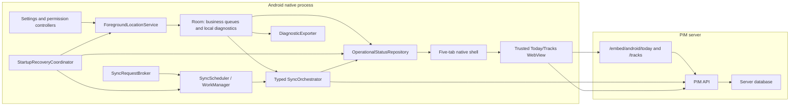

# PIM Android Client Complete Reliability Design

Date: 2026-07-10

Status: Conversation design approved; written specification awaiting user review

## Final Goal

Complete the Android client rather than polishing placeholders. The delivered client must:

- make device collection and transfer health understandable;
- make every visible action perform the behavior named by its label;
- show explicit manual and background synchronization progress and results;
- expose safe presets and bounded advanced settings;
- export a fact-rich diagnostic package for bug investigation;
- replace the hardcoded Today, Tracks, and Schedule surfaces with real data;
- reuse the server WebUI for server-owned mobile analytics and maps without turning the app into a full Web shell;
- close the additional reliability defects found during repository inspection;
- pass behavior-focused automated tests and signed-APK real-device verification.

The work is complete only after all three delivery phases and the final evidence matrix pass. Completing one phase does not redefine or reduce the overall goal.

## Confirmed Decisions

| Topic | Decision |
| --- | --- |
| Scope | Resolve every issue raised by the user plus relevant defects found during investigation. |
| Delivery | One coverage matrix, three focused implementation phases, final cross-phase verification. |
| Today and Tracks data | Display only data already received by the server. Never merge unsynced local records into server analytics. |
| Transfer visibility | Native UI always shows local pending counts, current transfer phase, last success, failure, and expected next attempt. |
| Automatic transfer | Manual sync immediately requests work; app foreground entry requests once with a cooldown; one 15-minute WorkManager job provides an inexact background fallback; network recovery and transient failures use WorkManager constraints/backoff. |
| Diagnostic privacy | Export includes raw location coordinates, accuracy, timestamps, provider data, and related diagnostic payloads by default. A confirmation warning is mandatory. Passwords, access tokens, refresh tokens, and Authorization headers are always excluded. |
| Settings | Three presets plus bounded advanced overrides, impact explanations, atomic apply, and restore defaults. |
| Web reuse | Keep a native five-tab shell. Today and Tracks use dedicated responsive Web embed routes. Schedule, Status, and Settings remain native. |
| Local logs | Structured logs remain local and exportable. They are not an upload queue and are never counted as pending business data. |
| Completion evidence | Unit, integration, rendered UI, emulator, signed APK, and real-device verification are required. Source-label tests and builds alone are insufficient. |

## Current Repository Evidence

### User-visible defects

- `ui/today/TodayScreen.kt` renders fixed zero values and a map placeholder. Its ViewModel only maps two status labels.
- `ui/tracks/TracksScreen.kt` has no ViewModel; its range chips have empty callbacks and all content is placeholder text.
- `ui/schedule/SchedulePolicyScreen.kt` has no ViewModel and always renders fixed schedule and policy copy even though `ScheduleWindowRepository` exists.
- `ui/status/StatusCenterScreen.kt` presents raw internal values without an overall health conclusion.
- The upload button in `StatusCenterContent` calls `onOpenStatus()` instead of `viewModel.syncNow()`.
- generic labels such as `去设置` and `查看状态` often remain on the same page or open the Settings tab rather than the relevant Android permission or service action.
- successful structured log messages are selected as `最近错误` because log level and active error state are not distinguished.
- the current connection test only validates URL syntax and does not perform network, API, or WebUI requests.
- tracking values exist in `TrackingSettingsStore` but are displayed as fixed text instead of editable settings.

### Transfer and persistence defects

- `PimApp` registers both `pim_upload` at 15 minutes and `pim_mobile_background_sync` at 60 minutes. Both call the same coordinator.
- `MainActivity` and `PimRootScreen` do not request the promised foreground-entry synchronization.
- `MobileSyncCoordinator.kt` exceeds 1,000 lines and combines device registration, gap discovery, collection, multiple upload categories, heartbeat, persistence, and state formatting.
- `mobile_logs` rows default to `PENDING`, but no Android upload call or server endpoint consumes them. `pendingLogCount()` therefore creates a permanently inflated upload total.
- sync batch and device-profile bookkeeping are also mixed into the user-facing business upload total.
- `MobileOverviewRepository.loadToday()` derives Today using UTC rather than the user's device timezone.

### Web reuse defects and assets

- the Web client already contains React Leaflet, OpenStreetMap tiles, track lines, stay markers, quality display, segment selection, and mobile analytics APIs.
- the existing desktop `/location-history` and `/mobile-records` routes include the full desktop `AppLayout`, Sidebar, and floating controls, so they are not suitable as direct mobile embeds.
- `PimWebViewScreen.buildPimWebUrl()` appends a Web route to the stored `/api/v1/` URL instead of deriving the Web origin.
- the existing WebView writes only the access token after `onPageFinished`; React authentication is evaluated before that injection, and refresh token rotation cannot remain consistent with native auth.
- `PimShellActivity` does not supply the configured server address or native tokens to `PimWebViewScreen`.

### Verification gap

- `AndroidV2ScreenContentTest` primarily checks whether source files contain approved Chinese labels. Placeholder screens pass it.
- the existing manual report explicitly records that no physical device or emulator was used.
- this machine has Android SDK emulators named `Pixel_9` and `Pixel_Tablet`, but no physical device is currently connected over ADB.

## Scope

### Included

- native operational status and transfer state;
- correct permission, service, login, API, queue, and diagnostic actions;
- one synchronization scheduler and a typed, persistent run history;
- local diagnostic retention, viewing, clearing, and ZIP export;
- editable collection profiles and advanced settings;
- real connection probing;
- dedicated Android Web embed routes for Today and Tracks;
- responsive server-backed maps, analytics, filters, segments, and raw points;
- real native schedule-policy data and transitions;
- database and WorkManager migration from the currently shipped shape;
- behavior, integration, visual, emulator, and real-device verification.

### Explicitly excluded

- showing unsynced local records as if the server had received them;
- automatic upload of local diagnostic logs;
- replacing all five tabs with a Web shell;
- native calendar CRUD in the Schedule tab;
- accepting location points with horizontal accuracy greater than or equal to 50 meters;
- silently exposing native refresh tokens to Web content;
- claiming overall completion before the final physical-device matrix passes.

## Delivery Program

1. **Operational foundation**: status, sync, scheduler migration, settings, permissions, connection probe, diagnostic retention/export, and Room migration.
2. **Server data surfaces**: secure Web embed infrastructure, Today, Tracks, responsive Web routes, maps, transfer banners, and post-sync refresh.
3. **Schedule and end-to-end completion**: real schedule policy, stale-cache behavior, cross-page integration, emulator coverage, signed APK, and physical-device verification.

Each phase is implemented and reviewed in a focused PR. A master coverage report tracks every requirement across the three PRs.

## Architecture



### Ownership boundary

Native Android owns facts that only the device can know reliably:

- runtime permissions and Android settings;
- foreground service and current collection policy;
- pending business queue and oldest pending age;
- current and historical sync runs;
- WorkManager state and expected retry;
- local dropped-point diagnostics, policy transitions, and logs;
- diagnostic export and Android share intents.

The server WebUI owns server-received analysis:

- today's server-backed movement and usage summaries;
- location maps and historical ranges;
- track and segment analytics;
- raw server point pagination;
- map provider, tile style, and future Web map SDK changes.

### Android component boundaries

| Component | Responsibility | Depends on |
| --- | --- | --- |
| `SyncRequestBroker` | Accept manual, foreground, periodic, and retry triggers; coalesce duplicate requests. | `SyncScheduler`, `SyncRunStore` |
| `SyncScheduler` | Own the one periodic work name and one unique immediate work chain; expose WorkInfo. | WorkManager |
| `StartupRecoveryCoordinator` | Reconcile process start, boot, and app-update state: ensure canonical work, recover stale leases, and restore user-requested collection when Android permits. Persist an actionable recovery result when it cannot. | `SyncScheduler`, settings, prerequisite checks, `ForegroundLocationController` |
| `SyncExecutionGate` | Prevent concurrent periodic and immediate runs using a persistent lease. The lease records run ID, owner, acquisition time, and expiry so a later run can recover after process death. | Room transaction |
| `SyncOrchestrator` | Advance typed phases and call independent upload steps. It does not collect UI strings. | Step interfaces, `SyncRunStore` |
| `DeviceRegistrationStep` | Upsert and register device metadata. | API, DAO |
| `UsageSyncStep` | Discover gaps, collect requested windows, and upload usage/apps. | usage collectors, API, DAO |
| `LocationSyncStep` | Upload accepted queued points and retain unconfirmed rows. | API, DAO |
| `HeartbeatStep` | Report the final run summary without rewriting successful upload facts. | API |
| `OperationalStatusRepository` | Combine health, transfer activity, WorkInfo, permissions, service, and diagnostic evidence. | stores and controllers |
| `ConnectionProbeService` | Perform staged URL, network, API, version, auth, and WebUI checks. | OkHttp, configured URLs |
| `DiagnosticExporter` | Build, validate, and share the diagnostic ZIP. | DAOs, status, WorkManager, FileProvider |
| `EmbeddedWebSessionController` | Build the trusted Web origin, create/destroy WebView, bridge in-memory access credentials, and publish refresh events. | TokenManager, AndroidX WebKit |

### Dedicated Web embed application

The Web client adds routes outside the desktop `AuthProvider` and `AppLayout`:

- `/embed/android/today`
- `/embed/android/tracks`

These routes:

- render no desktop Sidebar, quick-note control, or duplicate navigation;
- use a small `AndroidEmbedAuthProvider`;
- request an access token over `WebViewCompat.addWebMessageListener` from the configured origin only;
- keep the access token in memory and never receive the native refresh token;
- request one native token refresh and retry once after a 401;
- accept native `sync-completed` and `auth-cleared` messages;
- reuse existing mobile analytics and Leaflet components through focused responsive wrappers.

The native WebView:

- derives the Web root by parsing the configured URL and removing the terminal `/api/v1` path;
- restricts main-frame navigation and the message bridge to that exact scheme, host, port, and permitted embed paths;
- opens external links outside the WebView;
- disables file and content access;
- destroys the WebView when its Compose owner leaves composition;
- shows a native loading, auth, network, HTTP, or Web-resource error surface instead of a blank page.

## Operational State Model

### Health is not transfer activity

`OperationalHealth` is one of:

- `Healthy`: all enabled functions are operational;
- `NeedsAttention`: data still flows, but a quality or optional capability is degraded;
- `Blocked`: an enabled core function cannot operate;
- `Unknown`: evidence is missing or stale enough that health cannot be claimed.

Permission, provider, foreground-service, queue, and WorkManager evidence is read live or from their latest persisted transition. Status and Settings probe on entry and expose manual refresh; while either screen remains visible, stale evidence is probed again. A connection probe is fresh for five minutes; after that it is labeled stale and cannot support a `Healthy` conclusion until refreshed. The absence of recent business data alone does not make health unknown when collection is intentionally disabled or no data is expected.

`SyncPhase` is a separate typed value:

- `Queued`
- `CheckingPrerequisites`
- `WaitingForNetwork`
- `WaitingForAllowedNetwork`
- `RegisteringDevice`
- `QueryingGaps`
- `CollectingUsage`
- `UploadingUsage`
- `UploadingLocations`
- `ReportingHeartbeat`
- `Verifying`
- `Succeeded`
- `SucceededWithRejects`
- `RetryScheduled`
- `Blocked`
- `Failed`
- `Interrupted`

Uploading is activity, not a health warning. A healthy device can be uploading, and a blocked collection service can coexist with a successful upload of already queued data.

### Persistent sync run

Each trigger creates or joins a `SyncRun` with:

- run ID and WorkManager ID;
- trigger source;
- requested, started, and finished timestamps;
- phase and human-readable progress key;
- category, window index, and known total windows;
- queue counts at start and finish;
- attempted, accepted, skipped, rejected, failed, and server-confirmed counts by category;
- last HTTP status, structured error code, safe message, and detailed cause chain;
- next expected attempt and retry count;
- terminal outcome.

The UI derives Chinese copy from structured phase and error codes. Raw codes remain available in diagnostic detail and export.

### Queue classification

`BusinessUploadQueueSnapshot` includes only:

- accepted pending location points;
- pending usage events;
- pending usage summaries;
- pending app metadata.

It also exposes total count, oldest pending age, and approximate bytes where available.

`LocalDiagnosticSnapshot` separately includes:

- structured logs;
- dropped location diagnostics;
- policy transitions;
- sync run history;
- local storage bytes.

`DeadLetterSnapshot` contains permanently rejected business rows and their server evidence. These rows are not silently deleted and are not retried without a data or contract change.

Device profile and sync history bookkeeping are never presented as pending user data.

Collection intent is durable and separate from process-local service state. `TrackingSettingsStore` retains whether the user wants continuous collection enabled. A persisted `StartupRecoveryRecord` stores the latest trigger, attempt time, outcome, blocking reason, and required action. A killed service or failed boot recovery therefore cannot be mistaken for a user-disabled setting.

## Synchronization Scheduling And Data Flow

### Triggers

| Trigger | Behavior |
| --- | --- |
| Manual | Immediately write `Queued`, enqueue expedited unique work, and show feedback. If a run is active, join it rather than duplicate it. |
| Foreground entry | Request once per foreground session, with a five-minute cooldown across rapid activity recreation. |
| Periodic fallback | One `pim_mobile_sync_periodic` request with a 15-minute interval and the user's connected/unmetered network constraint. The time is approximate and may be delayed by Android. |
| Network recovery | A constrained queued request becomes eligible when Android reports an allowed network. Execution is not promised at the exact recovery second. |
| Transient retry | WorkManager exponential backoff after timeout, I/O failure, 429, or 5xx. The next estimate is visible. |

Manual and foreground requests use one unique immediate work name, `pim_mobile_sync_once`. The persistent execution gate prevents overlap with the periodic worker.

On upgrade, startup migration cancels:

- `pim_upload`
- `pim_mobile_background_sync`

It then registers only `pim_mobile_sync_periodic`.

### Boot, update, and process recovery

The manifest registers a receiver for `BOOT_COMPLETED` and `MY_PACKAGE_REPLACED`, together with `RECEIVE_BOOT_COMPLETED`. It accepts only those protected system actions and, for replacement, this app's package. The app is not direct-boot aware because its settings and Room database use credential-protected storage, so reconciliation begins after the user has unlocked the device. The receiver uses bounded asynchronous work and delegates all decisions to `StartupRecoveryCoordinator`.

Reconciliation is idempotent and follows this order:

1. run the versioned old-work migration and ensure exactly one `pim_mobile_sync_periodic` request exists;
2. expire any sync execution lease past its recorded expiry and mark its run `Interrupted`;
3. read the durable continuous-collection intent without changing it;
4. if collection is disabled by the user, leave the service stopped and record `NotRequested`;
5. if collection is enabled, evaluate the permissions, location provider, and Android foreground-service rules required for a location service;
6. start `ForegroundLocationService` only when Android permits that start, then verify and persist its runtime result;
7. otherwise retain the enabled intent and persist `UserActionRequired` with the exact permission, system setting, or visible-app restart action.

`PimApp` also performs the scheduler and stale-lease portion on every process creation. The first visible foreground entry performs the full collection reconciliation, which catches OEM-suppressed boot broadcasts and background-start restrictions. `ForegroundServiceStartNotAllowedException`, `SecurityException`, and service startup timeout are recorded as explicit recovery failures; none silently disable the user's collection preference. Background sync remains independent: its connected-network work can continue even when location collection needs user action.

### Run flow

1. Persist the trigger and starting queue snapshot.
2. Validate API configuration and auth.
3. If the network is absent, persist `WaitingForNetwork`; if only a disallowed metered network exists, persist `WaitingForAllowedNetwork`. Leave the constrained work queued in either case.
4. Register or refresh the device profile.
5. Query server gap windows for usage data.
6. Collect and upload requested usage windows and app metadata.
7. Upload pending accepted location rows.
8. Report heartbeat separately.
9. Re-read local queues and persist the terminal result.
10. On success or partial success, notify open embed routes to invalidate server queries without resetting filters.

### Acknowledgement rules

- queue rows are inserted before any request;
- only explicit server acknowledgement marks a row synced;
- partial success marks only acknowledged rows;
- transient failures preserve rows for retry;
- permanent item-level validation failures move to the dead-letter view with request and response evidence;
- cancellation or process death changes a stale running record to `Interrupted`; the next run starts from unconfirmed rows;
- no retention job can delete pending business or dead-letter rows.

### Required ingest acknowledgement contract

Aggregate accepted/rejected counts are insufficient for durable item-level decisions. The mobile usage ingest contract is extended with stable client item keys and explicit item results:

```text
MobileIngestItemResult
  clientItemKey
  entityType
  outcome: accepted | skipped | rejected | failed
  code
  message
```

Usage events and summaries send their local row ID as `clientItemKey`; app metadata uses a stable package/version key. `MobileIngestResponse` retains aggregate counts and adds `itemResults`.

`GET /api/version` adds a capability list. This program requires:

- `androidEmbedV1`
- `mobileItemResultsV1`

When talking to an older aggregate-only server, Android may mark a whole request successful only when `accepted + skipped` equals the sent count and both rejected and failed are zero. Any ambiguous aggregate response retains the affected rows, records `server-ack-ambiguous`, and reports an incompatible-server action instead of guessing which rows succeeded.

### Failure classification

| Failure | User state | Automatic behavior | User action |
| --- | --- | --- | --- |
| Missing/invalid URL | Blocked | Do not retry repeatedly. | Open API settings. |
| DNS, connect timeout, or transient I/O failure | Retry scheduled; Needs attention after three consecutive runs | Retain queue and continue bounded backoff. | Inspect probe detail or retry. |
| TLS certificate, hostname, or protocol validation failure | Blocked | Retain queue and stop automatic request retries until the server or URL changes. | Inspect certificate detail or fix the server URL/certificate. |
| HTTP 404/wrong API path or incompatible capability | Blocked | Retain queue and stop automatic request retries until configuration or server version changes. | Fix URL or update server. |
| Missing login or refresh rejected after one native refresh attempt | Blocked | Retain queue and do not loop refresh requests. | Open login. |
| Missing usage access | Needs attention | Skip only usage collection; still upload location and other eligible categories. | Open Usage Access settings. |
| No network | Waiting for network | WorkManager waits for constraint. | Optional manual retry after network returns. |
| Metered network while unmetered is required | Waiting for allowed network | WorkManager waits for an unmetered network. | Wait, change the preference, or explicitly approve a one-run mobile-data override. |
| Timeout, 429, or 5xx | Retry scheduled | Exponential backoff. | Retry now if desired. |
| Item-level 4xx | Succeeded with rejects | Move invalid item to dead-letter evidence. | Inspect or export diagnostics. |
| Heartbeat failure after uploads | Needs attention | Do not roll back confirmed data. | Retry heartbeat in next run. |

## Status Center

### Layout

1. **Overall conclusion**: current health, impact, evidence time, and count of actionable issues.
2. **Needs action**: only active issues requiring a user action.
3. **Data transfer**: trigger source, phase, category/window, counts, server confirmation, pending business data, last success, and next expected attempt.
4. **Collection and connection**: live API probe, login, permissions, service, current policy, next expected location, and last accepted point.
5. **Diagnostic evidence**: active errors, last rejection with localized explanation, diagnostic history, and export.

### Actionable issue contract

Each `StatusIssue` contains:

- stable code;
- health severity;
- title;
- what happened;
- impact on collection or transfer;
- evidence and last occurrence time;
- automatic recovery behavior;
- exact action type and action label;
- optional technical details.

The action label must match its effect:

| Issue | Action |
| --- | --- |
| API address | Navigate to the API settings section. |
| Login | Navigate to account login. |
| Notification or runtime permission | Launch the corresponding permission request. |
| Background location | Open this app's Android location permission settings. |
| Usage access | Open `ACTION_USAGE_ACCESS_SETTINGS`. |
| Battery optimization | Open the relevant Android battery settings. |
| Service stopped while collection is requested | Call the foreground service controller and show the result. |
| Collection not restored after reboot or update | From the visible app, start collection; if a prerequisite is missing, route to that exact permission or system setting instead. |
| Queue backlog or sync failure | Request synchronization and focus the transfer section. |
| Approximate-only permission or disabled provider | Open this app's location permission settings or system location settings, respectively. |
| Poor fixes while permissions/providers are ready | Open the location-quality evidence view; do not claim a settings change will fix sensor conditions. |
| Diagnostic history | Open the actual diagnostic detail view. |

Current policy and historical success messages are informational status, not issues.

### Manual sync feedback

Immediately after a tap:

- the button changes from `立即同步` to the current state;
- duplicate taps are disabled or join the active run;
- the transfer section shows `手动触发` and a queued/preflight phase;
- known totals show a progress bar; unknown totals show phase, window, and processed counts without a fake percentage;
- success shows server-confirmed counts and the remaining queue;
- failure shows the failed stage, data safety, and retry plan;
- when an unmetered-only preference blocks the run, the page says it is waiting for Wi-Fi/unmetered access and offers a clearly confirmed one-run mobile-data override;
- Today and Tracks refresh after a successful or partially successful server acknowledgement.

## Today And Tracks

### Native wrapper

Both tabs retain native:

- page title and bottom navigation;
- server data timestamp;
- local pending business count and active transfer state;
- current local collection health;
- a reliable link to the transfer section;
- native Web load/auth/error fallback.

The Compose container does not wrap the WebView in another vertical scroll owner. The embed page owns body scrolling below the stable native header.

### Today embed

`/embed/android/today` shows:

- server-backed track map preview;
- stays, distance, usable points, rejected count, and completeness;
- foreground usage total and top apps;
- generated/server-updated time;
- clear loading, server-empty, filtered-empty, auth, and request-error states.

The Today query uses the WebView/device IANA timezone to calculate the selected local-day boundary, sends an explicit UTC start and end to the server, and displays the returned server timestamp in local time. It never derives `Today` from a bare UTC calendar date. Tracks custom ranges use the same explicit boundary rule.

An empty server response is interpreted with native context:

- pending local data: `手机已采集，仍在等待上传`;
- collection disabled and no pending data: `尚未开始采集`;
- no data in the selected day after a successful sync: a true empty state;
- server request failure: error with retry and Status access.

### Tracks embed

`/embed/android/tracks` provides:

- Today, 7 days, 30 days, and custom range controls;
- device and quality filters;
- server map with track paths, stay points, quality/accuracy overlays, and gaps;
- segment timeline and selection;
- selected segment duration, distance, point count, speed, average/max accuracy, provider mix, altitude availability, and quality flags;
- paginated raw server points scoped to the selected segment;
- stable mobile layout at 360 x 800 and 412 x 915 CSS pixels.

Map provider and style stay inside shared Web map components. Android does not depend on a native map SDK.

## Schedule

The Schedule tab remains native because its primary purpose is to explain device policy, not to replace calendar management.

It combines:

- real calendar events from `ScheduleWindowRepository`;
- current runtime policy and anchor from the location service;
- recent local policy transitions from Room;
- a persisted cache of the last successful schedule query.

The page shows:

- current active schedule with location, or an accurate no-active-schedule state;
- the next schedule with location;
- active interval, anchor, entry reason, and exit conditions;
- upcoming location-bearing schedules;
- recent transitions such as entry, motion observation, 100-meter recovery, end, and restore;
- API failure, unparsable event, and stale-cache diagnostics.

Schedule queries cover events overlapping the previous six hours and the next seven days; a long-running active event remains included even when it began before that window. Queries run at service start, app foreground entry, every 30 minutes while collection is active, and after a known schedule boundary.

Schedule cache entries store `fetchedAt`. A cache no older than six hours may drive policy. Older cache remains display-only and visibly stale; runtime falls back to the normal collection interval rather than entering low-frequency mode from stale evidence. If the API is unavailable and no cache exists, the page shows an error, not `当前没有日程`.

## Settings

### Server and account

- edit and save API URL;
- derive and display the WebUI root;
- login and logout against the saved API;
- display token validity without exposing tokens;
- perform a real staged connection probe.

The connection probe performs:

1. URL parsing and normalization;
2. anonymous `GET /health` with latency;
3. `GET /api/version` compatibility and `androidEmbedV1`/`mobileItemResultsV1` capability check;
4. authenticated `GET /api/v1/status/summary` when a token exists;
5. Web root request and embed route bootstrap check;
6. structured mapping for DNS, connect, timeout, TLS, HTTP, auth, wrong path, and incompatible version failures.

Saving a syntactically valid URL does not claim the server is reachable. Probe results include check time and stage.

### Collection presets

| Preset | Normal | Schedule low frequency | Motion observation | Recovery distance |
| --- | ---: | ---: | ---: | ---: |
| Power saving | 3 min | 15 min | 60 sec | 100 m |
| Balanced | 2 min | 10 min | 45 sec | 75 m |
| High frequency | 1 min | 5 min | 30 sec | 50 m |

All presets use a 50-meter threshold with a strict `accuracy < threshold` predicate, so no preset accepts a fix at or above 50 meters. Altitude wait defaults to 15 seconds.

### Advanced bounds

| Setting | Allowed range |
| --- | --- |
| Normal interval | 1-15 minutes |
| Schedule low-frequency interval | 5-60 minutes |
| Motion observation interval | 30 seconds-5 minutes |
| Recovery distance | 25-500 meters |
| Maximum accepted horizontal accuracy | 10-50 meters, with the comparison remaining strict `< threshold` |
| Altitude wait | 0-30 seconds |
| Log retention | 1, 7, 14, or 30 days |

Changing any advanced value marks the profile `custom` while retaining the originating preset for restore.

Settings are validated as one object and written atomically. If collection is running, a successful write causes the service to recalculate policy and next expected location. A failure rolls back the complete object and displays the reason.

### Permissions and system constraints

The page displays and acts on:

- notifications;
- precise foreground location;
- background location;
- usage access;
- activity recognition;
- battery optimization status;
- foreground service runtime state.

Permission state refreshes whenever the app returns to the foreground. Turning on continuous collection walks through required missing permissions instead of silently turning itself off.

### Upload preference

The user can allow any connected network or require an unmetered network, normally Wi-Fi. Foreground, periodic, and retry work honor this preference. A manual run also honors it unless the user explicitly confirms a one-run mobile-data override. After a successful preference save, the scheduler updates the canonical WorkManager constraints under the same unique name, so no second periodic request is created. The 15-minute fallback interval is displayed as system-controlled and is not exposed as a misleading exact timer.

## Local Diagnostics And Export

### Local-only log semantics

Structured logs are local diagnostics. They have level, operation, message, safe details, optional throwable, and timestamp. They never enter the business upload total.

Default retention is:

- 7 days;
- a 20 MB hard cap;
- oldest records removed first;
- pending business rows and dead-letter rows excluded from cleanup.

Verbose logging can be enabled for 24 hours and then automatically returns to standard level.

### Diagnostic ZIP

The exporter supports the last 24 hours, 7 days, or all retained diagnostics. The default is 7 days.

The ZIP contains:

| File | Contents |
| --- | --- |
| `manifest.json` | export schema, generated time, app/build, Android/device version, selected range |
| `status.json` | complete operational health and current transfer snapshot |
| `settings.json` | effective settings and server URL, excluding credentials |
| `workmanager.json` | unique work names, IDs, states, attempts, constraints, and next estimates |
| `sync-history.jsonl` | SyncRun records and per-category counts |
| `logs.jsonl` | structured logs and throwable text |
| `location-points.jsonl` | raw retained location, accuracy, time, provider, altitude, status, and payload facts |
| `dropped-location.jsonl` | rejected local fixes and reason codes |
| `policy-transitions.jsonl` | policy entries, exits, anchors, and recovery evidence |
| `schedule-cache.json` | cached schedule metadata and freshness |
| `database-counts.json` | table counts and oldest/newest timestamps |

Before generation, the UI warns that raw coordinates are included. Passwords, access tokens, refresh tokens, Authorization headers, and login request bodies are excluded by construction and checked by an export validator.

The exporter writes to `cacheDir/diagnostics`, validates the ZIP manifest, shares a read-only `FileProvider` URI, and removes expired temporary packages within 24 hours. Export works without login or network access.

Clearing diagnostics requires confirmation. It removes local structured logs, dropped-fix diagnostics, policy transitions, stale schedule cache, and terminal sync runs except the newest terminal run. It never clears an active sync run, business queues, dead-letter records, settings, or auth.

## Database And Upgrade Migration

Current Room schema version 3 migrates to version 4 without destructive fallback.

Version 4 adds:

- `sync_runs`;
- `sync_dead_letters`;
- `schedule_window_cache`;
- indexes needed for run time, terminal status, and retention queries.

Migration behavior:

- existing `mobile_logs.sync_status` values become `local-only`;
- `pendingLogCount()` is replaced by local diagnostic count/bytes queries;
- existing sync batch rows become historical evidence and no longer count as uploadable data;
- device profile state is shown as registration state, not queue data;
- existing location, usage, metadata, settings, and auth remain intact;
- old WorkManager names are canceled once and the canonical periodic request is registered.

Tests use a version 3 fixture containing settings, auth-independent preferences, pending business rows, rejected rows, and 530 pending logs to prove the exact screenshot failure is removed without data loss.

## Security

- the Web message bridge accepts only the configured server origin and main frame;
- the embed route receives only a short-lived access token in memory; native refresh tokens never cross the bridge;
- 401 causes one bridge refresh request and one retry, then a native login-required state;
- logout clears Web in-memory auth and WebView site data for the configured origin;
- external navigation leaves the WebView;
- cleartext HTTP remains supported for the user's current server but shows a visible security warning;
- diagnostic export requires an explicit raw-location confirmation;
- token-shaped test markers are used to verify secret exclusion from generated ZIP files;
- logs never record passwords, raw auth responses, or Authorization headers.

## Error And UI State Rules

Every screen uses explicit `Loading`, `Content`, `Empty`, `Partial`, and `Error` states where applicable.

- no WebView failure produces a blank white surface;
- no missing schedule response is displayed as a true empty result;
- no successful log line is labeled an active error;
- no unknown total produces a fabricated percentage;
- no action button only expands the row unless its label explicitly says `查看详情`;
- internal reason codes are localized in primary UI and preserved verbatim in details/export;
- UI text uses device-local time while persisted facts remain UTC;
- fixed-format controls and maps have stable dimensions across loading, content, and error states;
- Android back navigation stays within allowed embed history before leaving the tab, and native bottom navigation remains authoritative.

## Testing And Verification

### Android unit and integration tests

- typed sync transitions and terminal outcomes;
- trigger coalescing and execution lease;
- queue acknowledgement, partial success, dead-letter, interruption, and retry planning;
- unique periodic work registration and old-work cancellation;
- connected/unmetered constraint updates, waiting state, and one-run manual override;
- boot, update, process-start, and first-foreground recovery idempotence, including collection disabled, permission blocked, background start denied, stale lease, and successful service restoration cases;
- foreground-entry cooldown;
- operational health and actionable issue planning;
- action-to-Intent/controller routing;
- connection probe failure matrix using MockWebServer;
- preset mappings, advanced bounds, atomic save, rollback, and restore;
- version 3 to 4 Room migration fixture;
- log retention and business-queue isolation;
- diagnostic ZIP schema, raw-coordinate inclusion, and secret exclusion;
- Web origin derivation, navigation allowlist, bridge messages, and 401 refresh;
- device timezone and Asia/Shanghai midnight boundaries;
- schedule cache freshness and policy transitions.

### Android rendered and emulator tests

- Compose interactions for all Status actions and manual sync feedback;
- Settings persistence and permission return refresh;
- WebView loading/auth/error/content surfaces against a controlled test server;
- Pixel_9 small-phone flows and Pixel_Tablet layout sanity;
- emulator cold-boot and update-reinstall recovery, followed by inspection of the unique work and collection recovery state;
- screenshots for each health and transfer state;
- `connectedDebugAndroidTest` on the Pixel_9 emulator.

### Web tests

- embed routes render without Sidebar or desktop controls;
- bridge auth blocks API queries until a trusted token arrives;
- 401 refresh and logout clearing;
- Today and Tracks loading, empty, partial, error, and content states;
- range and quality filters, segment selection, raw-point pagination, and post-sync invalidation;
- Playwright at 360 x 800 and 412 x 915;
- deterministic local tile fixtures verify nonblank map tiles and path overlays without depending on public tile availability;
- production Web build.

### Backend tests

- existing mobile analytics and location contracts used by embed routes;
- `/health` and `/api/version` probe behavior;
- authenticated status behavior;
- schedule event ranges and mobile queries;
- partial acknowledgement and validation responses remain explicit.

### Verification commands

```powershell
dotnet test Pim.sln
npm --prefix src/client-web run build
npm --prefix src/client-web run test:android-embed
cd src/client-android
.\gradlew.bat testDebugUnitTest --no-daemon
.\gradlew.bat connectedDebugAndroidTest --no-daemon
.\gradlew.bat assembleRelease --no-daemon
```

The implementation plan may add the targeted `test:android-embed` script, but it may not weaken existing build or test gates.

### Physical-device matrix

The signed CI APK must be tested on the user's actual phone for:

- fresh install and upgrade from the current APK;
- API save, real probe, login, logout, expiry, and refresh;
- each permission denial, grant, and system-settings return;
- continuous collection start/stop and service restart;
- screen off, app background, process kill, and phone reboot behavior;
- accepted `<50m`, rejected `>=50m`, and missing-altitude timeout cases;
- schedule low-frequency entry, motion/recovery, and exit;
- manual, foreground-entry, periodic, offline, recovery, timeout, 5xx, 401, and partial sync;
- Today and Tracks against the public server, including map and server timestamp;
- Schedule with no events, current event, upcoming event, stale cache, and server failure;
- diagnostic ZIP creation, share, unzip, raw coordinate presence, and credential absence;
- larger font and narrow-screen text/layout;
- upgrade proof that existing pending business rows remain while old logs no longer inflate upload totals.

Private diagnostic packages containing raw coordinates are not committed to Git.

## Phase Gates

### Phase 1: Operational foundation

Required outcomes:

- one scheduler and typed persistent sync runs;
- boot/update reconciliation with truthful collection recovery state;
- truthful Status actions and transfer feedback;
- real settings, permissions, presets, and connection probe;
- local log migration, retention, history, and export;
- Room migration and old-work cancellation;
- Android tests/build and a focused PR.

### Phase 2: Server data surfaces

Required outcomes:

- trusted Web bridge and dedicated embed routes;
- server-only Today and Tracks content;
- transfer and server-data timestamps in the native wrapper;
- responsive map and analysis interactions;
- Android, Web, backend, Playwright, and build verification;
- a focused PR.

### Phase 3: Schedule and completion

Required outcomes:

- real Schedule policy page and cache diagnostics;
- cross-page sync/auth refresh behavior;
- full emulator and signed-APK checks;
- physical-device matrix;
- requirement-by-requirement completion report;
- final focused PR.

After opening or updating each PR, all triggered GitHub Actions checks must be observed. If path filters trigger no relevant workflow, the absence is recorded explicitly.

## Completion Definition

The Android client is complete only when all of the following are proven:

1. Today, Tracks, and Schedule contain no production placeholder or fixed result copy.
2. every Status action performs its named effect and reports the result.
3. manual sync gives immediate, persistent, accurate feedback.
4. exactly one periodic sync task is registered and old tasks are removed.
5. after reboot or app update, the canonical worker is restored and enabled collection either resumes or reports an exact user action without losing the enabled intent.
6. local logs are absent from business upload counts and follow retention policy.
7. settings persist, validate, apply, roll back, and restore correctly.
8. diagnostic ZIPs contain the approved facts and exclude credentials.
9. Today and Tracks show only server-received data while native transfer state remains visible.
10. Web embed authentication and navigation respect the trusted-origin boundary.
11. schedule policy and stale/error states use real evidence.
12. version 3 upgrades preserve business data and settings.
13. all required automated commands pass.
14. all relevant GitHub Actions checks pass or their non-trigger is documented.
15. the signed APK passes the physical-device matrix.
16. the final coverage report has no unverified requirement.
