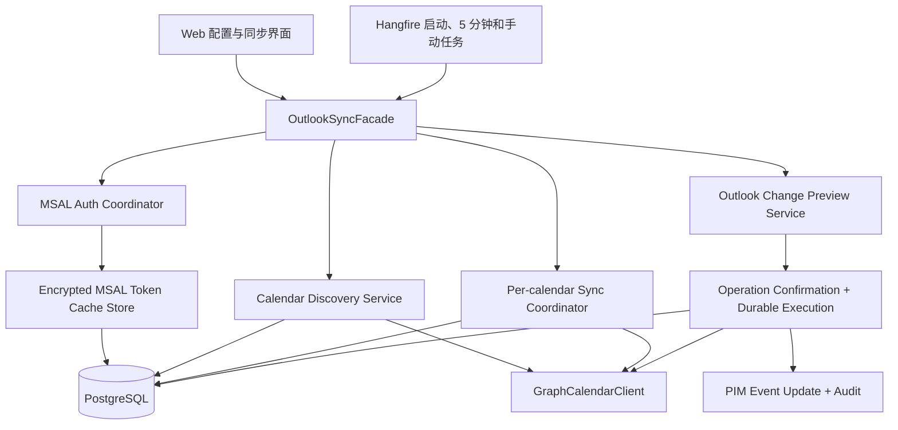
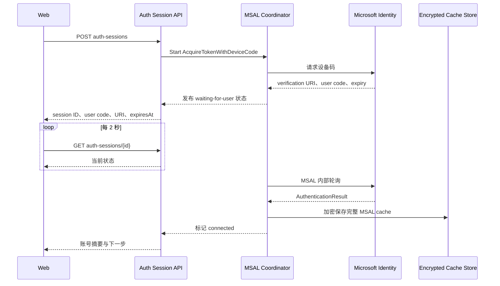

# Microsoft 日历同步完整设计

## 目标

把现有零散的 Outlook Graph 能力改造成一条可配置、可理解、可长期运行且不能绕过治理规则的微软日历同步链路。

完成后的用户体验必须满足以下目标：

- 普通用户可以只依赖界面引导完成 Microsoft Entra 应用注册，不需要预先了解 Tenant、Client ID、Scopes 或 Device Code Flow。
- 同时支持学校/企业账号和个人 Microsoft 账号，默认 authority 为 `common`。
- 使用 MSAL Device Code Flow 完成首次授权，后续使用加密持久化的 MSAL token cache 静默续期。
- 发现默认日历、日历分组内日历以及未分组日历，课程表等非默认日历不能遗漏。
- 首次同步默认读取过去 90 天至未来 365 天；启动时同步、每 5 分钟自动同步，并提供手动刷新。
- 提供“全部事件资源”和“指定时间范围实例补齐”两种手动深度同步。
- 定时事件内部统一存 UTC，界面按 `Asia/Shanghai` 显示；全天事件不发生日期偏移。
- 每个 Graph 读取请求有 30 秒单次尝试超时，并对明确的瞬时错误自动重试。
- Outlook 来源日程的编辑和删除不能直接修改本地事实。必须经过 L3 二级确认，Graph 成功后才提交 PIM 数据与审计。

## 现状核对

当前实现与目标只部分一致。

| 领域 | 当前实现 | 判断 |
| --- | --- | --- |
| Device Code Flow | `MicrosoftGraphDeviceCodeClient` 直接调用 OAuth `/devicecode` 和 `/token` 端点，见 `src/modules/Pim.Module.Calendar/Services/MicrosoftGraphDeviceCodeClient.cs:20` | 已有设备码协议，但没有使用 MSAL |
| Token 存储与续期 | access token 和 refresh token 经 Data Protection 加密存入数据库，并在过期前 5 分钟手工刷新，见 `OutlookTokenService.cs:19`、`:34`、`:53` | 基本能力存在，但业务代码直接管理 refresh token，不是 MSAL cache |
| 日历发现 | 没有 `/me/calendarGroups`、分组 calendars 或 `/me/calendars` 调用 | 缺失，课程表等非默认日历会遗漏 |
| 日程读取 | 只调用 `/me/calendarView/delta`，窗口为过去 30 天至未来 180 天，见 `OutlookSyncService.cs:671` | 只覆盖默认日历 |
| 分页与增量 | 已跟随 `nextLink` 并保存单一 `deltaLink` | 默认日历基础存在，但不能表达逐日历状态 |
| 时区 | `ParseGraphDateTime` 没有使用 Graph 返回的 `timeZone`，见 `OutlookSyncService.cs:678` | 对无 offset 的时间存在误判风险，也没有明确上海时区展示契约 |
| 超时与重试 | `AddHttpClient("outlook")` 没有专用超时或 resilience 配置，见 `CalendarModule.cs:39` | 使用 HttpClient 默认超时，且没有自动重试 |
| 配置界面 | 直接暴露 Tenant、Client ID、Scopes，见 `SyncPage.tsx:153`、`:162`、`:171` | 没有说明字段来源、Entra 注册步骤或公共客户端配置 |
| 设备码交互 | 用户必须手工点击“完成连接”，见 `SyncPage.tsx:233` | 没有自动等待授权，也没有按错误类型给出修复步骤 |
| 编辑治理规则 | `ScheduleFactConfirmationPolicy` 规定 Outlook 来源属于 L3 并需要二级确认 | 规则存在 |
| 普通编辑入口 | `EventEditorDialog` 直接调用普通 update，`CalendarService.UpdateEventAsync` 直接保存，见 `EventEditorDialog.tsx:113`、`CalendarService.cs:315` | 真实入口绕过了确认规则 |
| Graph 回写执行 | `OutlookSyncService` 有创建确认和执行 Patch 的方法，见 `OutlookSyncService.cs:306`、`:382` | 能力片段存在，但生产代码没有把编辑、确认和执行串起来 |

因此，当前系统不能视为已经实现用户提出的同步方式。认证约完成了一半，日历发现没有实现，读取只覆盖默认日历，配置引导和端到端确认执行链均不完整。

## 已确认决策

| 决策 | 结果 |
| --- | --- |
| 总体实现路径 | 在现有 API 内定向重构，不拆独立同步进程 |
| 认证库 | `Microsoft.Identity.Client`，Device Code Flow |
| Entra 应用来源 | 用户自行注册，界面提供完整引导 |
| 账号范围 | 学校/企业账号和个人 Microsoft 账号均支持，默认 `common` |
| 首次权限 | `Calendars.ReadWrite` 和 `User.Read` 委托权限 |
| 日历默认选择 | 所有发现的日历默认选中，用户可取消 |
| 自动同步 | 应用启动时、每 5 分钟、手动刷新 |
| 首次窗口 | 过去 90 天至未来 365 天 |
| 手动深度同步 | 全部事件资源 + 用户指定范围实例补齐 |
| Outlook 编辑 | Graph 成功后再同时提交 PIM 修改 |
| PIM 时区 | 内部 UTC，显示 `Asia/Shanghai` |

## 非目标

- 本阶段不实现 Microsoft Teams 会议接受、拒绝、暂定、参会状态或会议组织者工作流。
- 本阶段不依赖公网 webhook。PIM 是本地/自托管系统，不能假定存在稳定的公开通知地址。
- 本阶段不把 token cache 放到浏览器、Windows daemon 或 Android 客户端。这里的“本地加密存储”指 PIM API 所在安装实例的持久化数据库，并由该实例持有的 Data Protection key 加密。
- 本阶段不把 Microsoft Graph SDK 引入核心同步链。Graph REST 使用小型、明确、可测试的内部 DTO 和适配器。
- 本阶段不自动合并仅凭标题和时间相似的旧事件，也不静默解决 PIM 与 Outlook 的核心事实冲突。
- 本阶段每个 PIM 用户只允许一个活动 Microsoft connection，但该 connection 可以同步任意数量的 Graph 日历。多 Microsoft 账号同时连接不在本阶段范围内。
- 本阶段保证当前账号自身的日历和日历分组。共享邮箱、委托邮箱或需要额外 `Calendars.ReadWrite.Shared` 权限的日历不在本阶段完成标准内。

## 总体架构



### 组件职责

`OutlookSyncFacade`

- 对 API endpoint 和后台任务暴露连接、发现、选择、同步、诊断和编辑预览用例。
- 不直接发 HTTP，也不直接读取 token cache。
- 负责用户边界和 connection 边界校验。

`MsalOutlookAuthCoordinator`

- 按 connection 的 Client ID 和 authority 创建 public client application。
- 使用 `AcquireTokenWithDeviceCode` 启动授权，MSAL 负责 OAuth token 轮询。
- 使用 `AcquireTokenSilent` 为所有 Graph 操作取 token。
- 每个 connection 串行读写 token cache，防止并发回调覆盖。

`OutlookTokenCacheStore`

- 使用 ASP.NET Core Data Protection 加密和解密完整 MSAL cache blob。
- Data Protection key 继续持久化到当前受保护路径，不能随容器重建丢失。
- 不向业务服务暴露 refresh token，也不记录 cache 内容。

`GraphCalendarClient`

- 只实现需要的 Microsoft Graph REST 操作：账号摘要、日历分组、日历列表、calendar view、默认日历 delta、event resources、单事件读取和条件 Patch/Delete。
- 跟随 Graph 返回的绝对 `nextLink`，但只允许 HTTPS 且 host 为 Microsoft Graph 的 URL，避免任意绝对 URL 请求。
- 使用内部 DTO 隔离 Graph JSON 与领域模型。

`OutlookCalendarDiscoveryService`

- 执行完整发现算法并按 Graph Calendar ID 去重。
- 更新逐日历 binding，但在完整分页失败时不推断远端日历已删除。

`OutlookCalendarSyncCoordinator`

- 对 connection 获取互斥锁，避免自动、启动和手动任务重叠。
- 每个批次最多并发同步 2 个日历。
- 记录逐日历步骤、计数、错误和最终 `completed`、`partial`、`failed` 或 `canceled` 状态。

`OutlookConfirmedOperationHandler`

- 处理已通过二级确认的 Outlook 变更。
- 使用保存的预期 ETag/changeKey 做 Graph 条件写入。
- Graph 成功后更新本地事件、外部版本和审计。
- 使用 confirmation ID 与 proposed hash 保证重试幂等。

## 认证与配置向导

### Entra 注册引导

向导第一步必须提供外部链接和逐项清单：

1. 打开 Microsoft Entra 管理中心的“应用注册”。
2. 新建应用，名称可为 `PIM Calendar Sync`。
3. 账户类型选择“任何组织目录中的账户和个人 Microsoft 账户”。
4. 在“身份验证 -> 高级设置”中启用“允许公共客户端流”。
5. Device Code Flow 不要求用户填写重定向 URI。
6. 在 Microsoft Graph 委托权限中添加 `Calendars.ReadWrite` 和 `User.Read`。
7. 从应用“概述”页复制“应用程序(客户端) ID”。

界面必须醒目标明：Client ID 不是密码；不要创建或填写 Client Secret。系统不提供 Secret 输入框。

### 配置字段

首次连接只收集：

- `ClientId`：必须是 UUID 格式，来自 Entra 应用概述页。
- 账号范围：默认“组织账号 + 个人账号”。
- `TenantId`：上述账号范围固定为 `common`；只有选择“仅指定组织”时才显示 Directory tenant ID。

用户不直接编辑 Scopes。界面只读展示 `Calendars.ReadWrite` 和 `User.Read`。MSAL 管理 `openid`、`profile`、`offline_access` 以及 refresh token 所在的 cache。

### 设备码会话



实现约束：

- API 返回 user code 和 verification URI，不返回 OAuth `device_code`。
- UI 自动轮询 PIM auth session 状态，用户不再点击“完成连接”。
- 整个用户授权等待可以持续到微软代码过期；30 秒 Graph 请求超时不等于 30 秒授权总时长。
- 活跃的 MSAL acquisition task 由 coordinator 管理。服务重启后，未完成会话标为失败并提示重新开始，不尝试恢复过期设备码。
- session 状态包括 `starting`、`waiting-for-user`、`connected`、`expired`、`canceled` 和 `failed`。
- 错误按 Client ID 无效、公共客户端流未开启、用户取消、设备码过期、管理员同意受限、网络失败和 cache 损坏分别给出修复步骤。

### 后续 token 获取

所有 Graph 用例只调用 `AcquireTokenSilent`。当 MSAL 抛出需要交互的异常时：

- connection 标为 `reauth-required`；
- 自动同步暂停；
- 界面显示“重新连接 Microsoft 账号”；
- 不清空旧 cache，直到用户明确断开或新授权成功；
- 不回退到业务代码手工 refresh token。

## 数据模型

### OutlookConnection

保留现有 connection 概念并调整字段：

- `Id`、`UserId`、`Provider`
- `ClientId`、`TenantId`、`Authority`
- 固定权限摘要
- `HomeAccountId`
- `MsalCacheEncrypted`
- `Status`、`TokenHealth`、`LastError`
- `CreatedAt`、`UpdatedAt`
- 乐观并发版本

`AccessTokenEncrypted`、`RefreshTokenEncrypted`、`AccessTokenExpiresAt` 和 connection 级 `DeltaLink` 进入 legacy 阶段，不再被新代码读取。

### OutlookAuthorizationSession

- `Id`、`UserId`、`ConnectionId`
- `Status`
- `VerificationUri`、`UserCode`、`ExpiresAt`
- `AccountDisplayName`、`AccountLoginHint`，仅在成功后保存必要摘要
- `ErrorCode`、`ErrorMessage`
- `CreatedAt`、`UpdatedAt`

不持久化 access token、refresh token、MSAL cache 明文或 OAuth device code。

### OutlookCalendarBinding

- `Id`、`ConnectionId`、`PimCalendarId`
- `GraphCalendarId`
- `GraphGroupId`、`GraphGroupName`
- `Name`、`Color`、`OwnerName`、`OwnerAddress`
- `IsDefaultCalendar`、`CanEdit`、`CanViewPrivateItems`
- `IsSelected`，新发现日历默认 `true`
- `RemoteState`：`active` 或 `remote-missing`
- `SyncStrategy`：`default-delta` 或 `window-reconcile`
- `DeltaLink`，只允许默认日历使用
- `BaselineWindowStart`、`BaselineWindowEnd`、`LastFullBaselineAt`
- `LastDiscoveryAt`、`LastSyncedAt`、`LastSuccessfulGeneration`
- `LastErrorCode`、`LastErrorMessage`

唯一约束为 `(ConnectionId, GraphCalendarId)`。

每个选中的 binding 对应一个独立 PIM `CalendarEntity`，继承 Graph 名称和颜色，并带 Outlook 来源标记。这样课程表、考试日历和默认日历可以独立显示、过滤和暂停。

### Event 外部身份

在现有事件外部字段基础上增加：

- `OutlookConnectionId`
- `OutlookCalendarBindingId`
- immutable `OutlookEventId`
- `SourceUid` / `iCalUId`
- `SeriesMasterId`、Graph event `Type`
- `OutlookChangeKey`、`OutlookEtag`
- `OriginalStartTimeZone`、`OriginalEndTimeZone`
- `AllDayStartDate`、`AllDayEndDateExclusive`，仅全天事件使用
- `LastSeenSyncGeneration`

唯一约束为 `(OutlookCalendarBindingId, OutlookEventId)`。请求统一发送 `Prefer: IdType="ImmutableId"`，避免事件在同一邮箱内移动时普通 Graph ID 变化造成重复。

### Durable Operation Execution

确认记录继续表达 Pending、Confirmed、Executed、Rejected 和 Expired。新增持久化 execution/outbox 记录：

- `ConfirmationId`
- `OperationType`
- `ProposedHash`
- `State`：`queued`、`executing`、`retryable-failed`、`conflict`、`completed`
- `AttemptCount`、`NextAttemptAt`
- `LastErrorCode`、`LastErrorMessage`

二级确认和 execution 记录必须在同一数据库事务中提交。Hangfire 只负责唤醒 durable execution，不能成为唯一队列事实来源。

## 日历发现与选择

### 发现算法

1. 使用 MSAL 静默获取 access token。
2. 请求 `/me/calendarGroups`，跟随全部 `@odata.nextLink`。
3. 对每个分组请求 `/me/calendarGroups/{id}/calendars`，跟随全部分页。
4. 再请求 `/me/calendars` 作为未分组或返回差异的兜底。
5. 按 Graph Calendar ID 去重并 upsert binding。
6. 已存在日历保留用户的 `IsSelected`；新日历默认选中。
7. 只有整个发现过程和全部分页成功后，才把本次未返回的旧 binding 标为 `remote-missing`。

发现请求使用 `$select` 限定必要字段，并保存分组名称、日历颜色、默认标记、owner 和编辑能力。

### 选择规则

- 首次发现后默认选中全部日历。
- 用户可以按分组全部选择、逐日历取消或重新发现。
- 取消选择只暂停后续同步并隐藏对应 PIM 日历层，不删除已导入事件。
- 重新选中后重新建立该日历的同步基线。
- “移除已导入数据”是独立 L4 严格确认操作，不能与取消选择合并。
- 远端日历消失时保留本地数据并提示用户处理，不在发现任务中静默删除。

## 日程读取与同步模式

Microsoft Graph 官方文档列出默认日历的 `/me/calendarView/delta`，但没有列出 `/me/calendars/{id}/calendarView/delta`。因此不能假设非默认日历支持未文档化的逐日历 delta。

### 默认日历

- 首次读取 `/me/calendarView/delta?startDateTime=...&endDateTime=...`。
- 窗口是当前时刻往前 90 天、往后 365 天。
- 保存建立 delta 时的固定窗口。Graph delta token 不会随着当前日期自动扩展时间边界。
- 跟随 `nextLink`，只在终止页保存 `deltaLink`。
- 后续每 5 分钟使用保存的 `deltaLink`。
- 每天在本地低峰时段对默认日历重建一次滚动 -90/+365 天基线；重建成功后原子替换 deltaLink 和窗口边界。
- 显式处理 `@removed` tombstone，但先读取单个远端事件确认其是否仍存在。404 才表示删除；仍存在则按移动或修改处理。
- delta token 无效或窗口定义变化时，清空该 binding 的 deltaLink 并重建基线。

### 非默认日历

- 请求 `/me/calendars/{id}/calendarView?startDateTime=...&endDateTime=...`。
- 每次完成同一 -90/+365 天窗口的完整分页对账。
- 每次成功任务生成 sync generation，并为返回事件写入 `LastSeenSyncGeneration`。
- 已自然早于新窗口起点的事件只标为 `out-of-window`，不推断删除。
- 只有该日历全部分页成功后，才能把仍应与当前窗口相交、但本次未出现的事件列入 missing verification。
- missing verification 必须读取单个远端事件。404 才生成远端删除确认；仍存在说明事件被移动到窗口外或发生其他修改，应按远端变更处理。
- 分页、超时、取消或权限失败时不能推断删除。

### 共同读取规则

- 请求使用 `Prefer: outlook.timezone="UTC"` 和 `Prefer: IdType="ImmutableId"`。
- `nextLink` 被视为 opaque URL，不能重建或追加查询参数。
- 每个 connection 同时最多处理 2 个日历。
- 单个日历失败不阻断其他日历，批次标为 `partial` 并保留逐日历错误。
- 新的远端事件可自动创建 PIM 投影。
- 已存在事件的核心事实变化进入 L3 二级确认，不先修改本地事件。
- 远端删除进入 L3 二级确认，确认后软删除 PIM 投影。
- 同一 `(binding, event, remote ETag)` 只能有一个待确认项，避免每 5 分钟重复创建。

### 自动调度

- API 启动完成后为已连接 connection 入队一次同步。
- Hangfire 每 5 分钟扫描已连接且有选中日历的 connection。
- Hangfire 每天为默认日历执行一次滚动窗口完整基线，避免 delta 的固定结束时间漏掉新进入未来 365 天范围的事件。
- 手动刷新使用相同 coordinator。
- connection 级互斥锁防止启动、定时和手动任务重叠。
- 任务取消只停止尚未提交的读取和处理，不回滚已经完成的独立日历。

### 手动深度同步

`full-resources`

- 对全部或指定选中日历分页请求 `/me/calendars/{id}/events`。
- 获取全部单次事件和重复规则主事件。
- 用于补齐长期历史资源与 recurrence 元数据。
- 该模式只 upsert，不仅凭深度资源扫描推断历史事件删除。

`range-instances`

- 用户选择起止日期和日历范围。
- 系统按相邻的 180 天半开区间分片请求 `calendarView`。
- 展开指定范围内的重复实例。
- 所有分片通过 immutable event ID 去重，并展示可取消的逐日历进度。

## 时间、全天事件与重复日程

### 定时事件

- Graph 响应强制为 UTC。
- 无 offset 的 `dateTime` 必须按 UTC 明确解析，不能依赖服务器本地时区。
- 数据库存 `DateTimeOffset` UTC。
- Web 展示统一转换为 `Asia/Shanghai`。
- 保存 `OriginalStartTimeZone` 和 `OriginalEndTimeZone`，回写时优先保留原始时区语义。

### 全天事件

- 使用 `AllDayStartDate` 和 `AllDayEndDateExclusive` 保存开始日期和排他的结束日期语义；定时事件的这两个字段为空。
- 不把全天事件当作 UTC 时刻再加 8 小时。
- UI 使用日期控件而非 datetime-local。
- 回写保持 Graph 全天事件的日期边界。

### 重复日程

- `calendarView` 实例保存 immutable event ID、series master ID 和 occurrence 类型。
- `/events` 返回的 series master 保存 recurrence pattern/range。
- master 与 occurrence 不互相覆盖。
- PIM 的 recurrence 表达无法无损承载 Graph 规则时，保留原始 Graph recurrence JSON 作为外部元数据，禁止静默降级后回写。

## Outlook 编辑与二级确认

### 禁止普通更新旁路

普通 `PUT /calendar/events/{id}` 加载到 `source=outlook` 或存在 Outlook binding 时，必须拒绝直接更新并返回稳定错误码和专用 preview endpoint。该门禁在后端执行，不能只依赖 Web 判断。

当 binding 的 `CanEdit=false` 时，Outlook 投影在 PIM 中只读，不提供 preview、回写或远端删除命令。界面可以提供“复制为 PIM 日程”，复制结果是无 Outlook binding 的新本地事件。

### 编辑流程

1. Event editor 识别 Outlook 来源，把“保存”改为“预览回写”。
2. Web 向 preview endpoint 提交拟议字段。
3. 服务端重新加载事件、binding、connection 和当前外部版本，计算 changed fields。
4. 创建 `outlook.event.update` L3 confirmation，payload 保存 before、proposed、expected ETag/changeKey、target account、target calendar 和 proposed hash。
5. confirmation 进入现有确认中心；编辑器也可以直接展示同一记录的 before/after。
6. 用户先复核，再执行第二次明确动作“确认并回写 Outlook”。
7. 二级确认事务创建 durable execution。
8. handler 读取远端当前事件并校验 ETag/changeKey。
9. 条件 Graph Patch 成功后，在本地事务中更新 PIM 事件、外部版本、审计和 confirmation 状态。

确认前 PIM 和 Outlook 都不能改变。

### 幂等恢复

Graph 和 PostgreSQL 不能共享事务。若 Graph Patch 已成功但本地事务失败：

- 重试先读取远端事件；
- 若远端字段已经等于 confirmation 保存的 proposed snapshot，则不重复 Patch；
- 直接补交本地事件、外部版本和审计；
- confirmation ID 与 proposed hash 是幂等键；
- 审计唯一约束防止重复记录。

### ETag 冲突

当远端 ETag 与 preview 时不同，原确认进入 conflict 状态且不写任何一侧。冲突队列提供：

- 保留 PIM 拟议值并根据最新远端版本重新生成 L3 确认；
- 采用 Outlook 最新值；
- 逐字段合并并生成新确认；
- 暂不处理。

不能复用过期 before/after 快照。

### 删除与暂停

- 单个 Outlook 日程删除属于 L3 二级确认，Graph 删除成功后才软删除 PIM 事件。
- `CanEdit=false` 的远端日历不允许 Graph 删除；用户只能暂停该 binding，或通过独立治理操作移除本地投影。
- 批量删除、停止同步并移除数据属于 L4 严格确认。
- 暂停 binding 只停止同步，不删除数据；重新启用时重建基线。

## HTTP resilience

使用 `Microsoft.Extensions.Http.Resilience`/Polly 为 Graph 读取客户端配置标准化策略，避免手写睡眠与重试循环。

### 读取请求

- 每次尝试 30 秒超时。
- 最多 3 次总尝试，即首次请求加最多 2 次重试。
- 只重试网络瞬断、HTTP 408、429 和 5xx。
- 429 优先遵守 `Retry-After`。
- 其他重试使用带 jitter 的退避。
- 用户取消必须立即传播，不能转成 timeout 后继续重试。
- 400、401、403、404 和其他业务 4xx 默认不重试。

### 写请求

PATCH 和 DELETE 不使用透明 HTTP 自动重试。出现超时、连接中断或未知结果时，由 durable operation handler 先 GET 远端状态，再决定补交本地、重新条件写入或进入冲突，避免重复外部副作用。

### 认证错误

- Graph 401 时允许 MSAL force refresh 一次并重放一个安全读取请求。
- 再次 401 或 MSAL 要求 UI interaction 时标记 `reauth-required`。
- 403 标记权限或租户策略问题，不重试。
- 所有错误保留 Graph `request-id` 和本地 `client-request-id`，但不记录 Authorization header。

## API 契约

保留 `/api/v1/calendar/outlook` 前缀，拆分明确用例：

| Method | Path | 用途 |
| --- | --- | --- |
| `GET` | `/settings` | 读取非敏感配置和连接健康 |
| `PUT` | `/settings` | 保存 Client ID、账号范围和 Tenant |
| `POST` | `/auth-sessions` | 启动 MSAL Device Code Flow |
| `GET` | `/auth-sessions/{id}` | 查询 UI 可见的授权状态 |
| `DELETE` | `/auth-sessions/{id}` | 取消未完成授权 |
| `POST` | `/calendars/discover` | 重新发现并 upsert 日历 |
| `GET` | `/calendars` | 返回按分组组织的 binding |
| `PUT` | `/calendars/selection` | 保存选中状态 |
| `POST` | `/sync-runs` | 启动 incremental、full-resources 或 range-instances |
| `GET` | `/sync-runs/{id}` | 查询逐日历进度和错误 |
| `POST` | `/events/{id}/change-preview` | 创建 Outlook 编辑 L3 confirmation |
| `POST` | `/diagnostics` | 运行连接、权限、发现、读取和时区诊断 |

最终确认继续使用现有 operations confirmation endpoint。确认服务在同一事务中创建 durable execution；生产代码必须有 handler 消费 `outlook.event.update`、`outlook.event.delete` 和冲突解决操作，不能只把状态改成 Confirmed。

API 永远不返回 token、refresh token、MSAL cache、OAuth device code 或 Data Protection 内容。

## Web 体验

### 未连接状态

- 显示四步向导：注册应用、填写标识、授权账号、选择日历。
- 使用中文字段名和微软门户中的原始英文术语组合，便于用户对照。
- 每一步提供完成条件和返回 PIM 后的下一步。

### 等待授权状态

- 大号显示 user code，提供复制按钮。
- 提供打开 `microsoft.com/devicelogin` 的明确命令。
- 显示过期倒计时和“等待你在微软页面完成授权”。
- 自动轮询，不显示“完成连接”按钮。
- 支持取消和过期后重新请求。

### 日历选择状态

- 按 Graph calendar group 展示日历，另有“其他/未分组”。
- 每个日历显示颜色、默认标记、可编辑/只读和同步健康。
- 首次全部选中；提供全选、逐项取消和重新发现。

### 已连接状态

- 显示账号摘要、Tenant、授权范围、token cache 健康、上次同步和下次计划时间。
- 显示逐日历状态和批次步骤，不把 deltaLink 原文作为主要用户信息。
- 提供手动刷新、全部事件资源、指定范围补齐、运行诊断和重新授权。
- 来自 `CanEdit=false` 日历的事件显示只读标记，并提供“复制为 PIM 日程”而不是回写命令。

### 错误文案

每类错误包含：发生了什么、最可能原因、去哪里修改、重试按钮。微软原始错误码放在可展开技术详情中，不作为唯一提示。

## 安全与隐私

- 仅使用 public client，永不接受 Client Secret。
- `MsalCacheEncrypted` 使用当前实例持久化的 Data Protection key 加密。
- token cache 解密只发生在认证适配器内部。
- auth session、connection 和 calendar binding 全部按当前 PIM user 校验。
- 日志不记录 access token、refresh token、MSAL cache、Authorization header、OAuth device code、user code 或完整事件正文。
- 日志可记录 connection ID、binding ID、sync batch ID、confirmation ID、Graph request-id、状态码、耗时和重试次数。
- `Calendars.ReadWrite` 是用户明确批准的权限。界面解释该权限用于确认后的双向回写。

## 迁移设计

### 阶段 1：扩展

- 新增 MSAL cache、authorization session、calendar binding、事件外部身份和 durable execution 表/字段。
- 保留旧 token 与 connection deltaLink 列，不再由新路径读取。
- 数据库迁移可重复执行且不修改已有事件事实。

### 阶段 2：重新授权

- 保留已有 Client ID 和 Tenant。
- 现有 connection 标为 `reauth-required`。
- 不尝试把手工 access/refresh token 转换为 MSAL 私有 cache 格式。
- 新 MSAL 授权成功后保存 cache，并清空该 connection 的 legacy token 值。

### 阶段 3：发现与重绑

- 丢弃旧 connection 级 deltaLink，按新窗口逐日历重建基线。
- 旧 Outlook 事件优先按 iCalUId 重绑，其次只在已知 Graph event ID 能可靠对应时重绑。
- 不能可靠对应的事件标为 `legacy-unbound`，保持可见但禁止自动回写。
- 不使用标题和时间相似度自动合并。
- 首次基线在创建新事件前检查可靠外部身份，避免重复。

### 阶段 4：延迟清理

- 至少运行一个可回滚版本周期后再删除 legacy token 和 deltaLink 列。
- 清理前验证没有 connection 仍依赖 legacy 数据。

## 测试策略

### 后端单元测试

- Device code session 全状态转换。
- MSAL cache before/after access 回调、加密、并发写和损坏处理。
- `AcquireTokenSilent` 成功、force refresh、需要重新授权。
- calendarGroups、group calendars、root calendars 的全部分页与去重。
- Graph endpoint、query、Prefer header 和 nextLink host 校验。
- 30 秒超时、最多 3 次尝试、Retry-After、不可重试 4xx 和用户取消。
- 默认日历 delta、tombstone、无效 token 重建基线。
- 默认日历的固定 delta 窗口每日滚动重建，失败时保留旧 deltaLink。
- 非默认日历只有完整分页后才执行 missing verification；自然移出窗口不判删除，单事件 404 才判删除。
- 全部事件资源和 180 天范围分片。
- UTC、上海时区、全天日期、原始时区和 recurrence master/occurrence。
- 普通 event update 不能修改 Outlook 事件。
- `CanEdit=false` 日历只能读取或复制为 PIM 日程，不能进入 Graph Patch/Delete。
- confirmation 前两边不变，Graph 失败时本地不变。
- ETag 冲突、Graph 成功后 DB 失败的幂等恢复。
- legacy 配置、token、delta 和事件迁移不丢失、不误匹配、不重复。

### API 集成测试

- 使用 fake MSAL adapter 和可编程 Graph `HttpMessageHandler`，不依赖真实微软账号。
- 验证当前用户隔离和跨用户 ID 拒绝。
- 验证 settings、auth session、discovery、selection、sync run、diagnostics 和 change preview 契约。
- 验证二级确认会创建 durable execution，并由注册 handler 执行。

### Web 测试

- 四步向导与 Client ID 校验。
- 页面没有 Client Secret 字段，也不能编辑原始 scopes。
- 设备码自动轮询、复制、倒计时、取消、过期和错误恢复。
- 日历分组、默认全选、只读标记、取消选择不删除。
- incremental、full-resources 和 range-instances 的进度与取消。
- Outlook 编辑 before/after、二次动作、冲突和恢复状态。
- 键盘导航、焦点恢复、错误关联，以及 360px 和桌面布局无溢出。

实现时新增 `npm --prefix src/client-web run test:outlook-sync`，只包含可重复、无真实凭据的测试。

### 本地验证命令

```powershell
dotnet test Pim.sln
npm --prefix src/client-web run build
npm --prefix src/client-web run lint
npm --prefix src/client-web run test:outlook-sync
```

## 真实账号验收

CI 不保存真实 Microsoft 凭据。实现完成后必须用至少一个真实账号执行手工验收；可获得组织账号时，再覆盖学校/企业租户策略场景。

1. 在全新设置状态下，不阅读仓库文档，只按界面完成 Entra 注册和设备码授权。
2. 验证个人/组织账号类型、公共客户端流和管理员同意受限时的错误指引。
3. 确认课程表日历出现在正确分组，默认选中并映射为独立 PIM 日历。
4. 抽查定时、全天和重复事件，PIM 上海时间与 Outlook 一致。
5. 等待或注入 access token 过期，确认 MSAL 静默续期。
6. 运行自动同步、手动刷新、全部事件资源和指定范围补齐。
7. 修改测试 Outlook 日程，确认二级确认前两边不变，确认后两边一致且有审计。
8. 模拟 429、30 秒超时、ETag 冲突和重新授权，验证明确状态与恢复入口。
9. 在迁移数据库验证旧事件没有丢失、误合并或重复。

## 完成标准

以下证据全部存在时，微软日历同步才算完成：

- 新数据库和迁移数据库的后端测试通过。
- Web 构建、lint 和专用 Outlook 测试通过。
- MSAL Device Code Flow 与加密 token cache 的自动化证据通过。
- 日历分组、课程表日历和未分组日历的发现证据通过。
- 默认日历 delta 与非默认日历窗口对账均有覆盖。
- 两种手动深度同步均有分页、去重、进度和取消证据。
- UTC、Asia/Shanghai、全天和 recurrence 的测试通过。
- 普通编辑入口不能绕过 L3 二级确认。
- Graph-first 提交、ETag 冲突和幂等恢复测试通过。
- 真实账号验收记录完成。
- PR 中触发的 API 与 Web GitHub Actions 通过；如果某次纯文档 PR 不匹配 workflow path filter，则明确记录未触发。

## 官方接口依据

- [List calendar groups](https://learn.microsoft.com/en-us/graph/api/user-list-calendargroups?view=graph-rest-1.0)
- [List calendars in a calendar group](https://learn.microsoft.com/en-us/graph/api/calendargroup-list-calendars?view=graph-rest-1.0)
- [List calendar view](https://learn.microsoft.com/en-us/graph/api/calendar-list-calendarview?view=graph-rest-1.0)
- [Get incremental changes to events in a calendar view](https://learn.microsoft.com/en-us/graph/api/event-delta?view=graph-rest-1.0)

这些接口依据只支持已文档化路径。本设计不调用未文档化的 `/me/calendars/{id}/calendarView/delta`。
